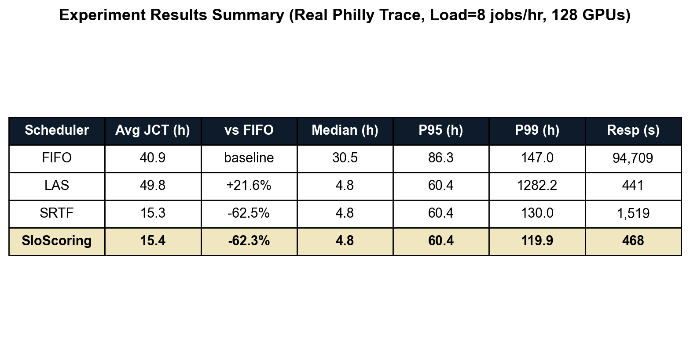
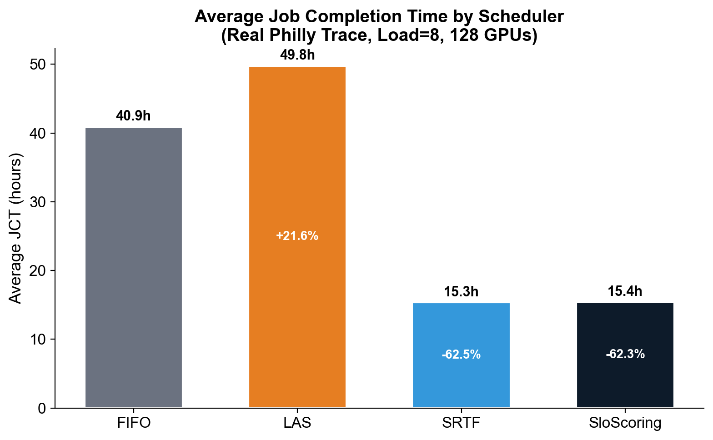
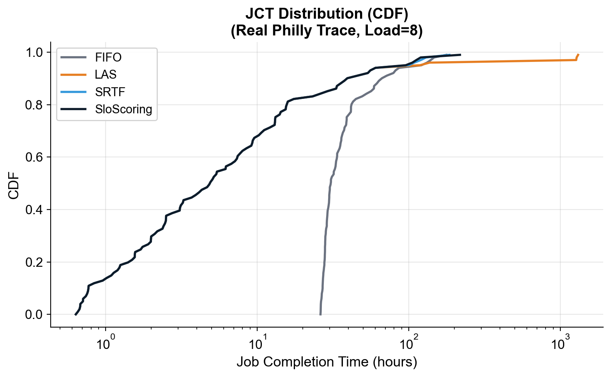
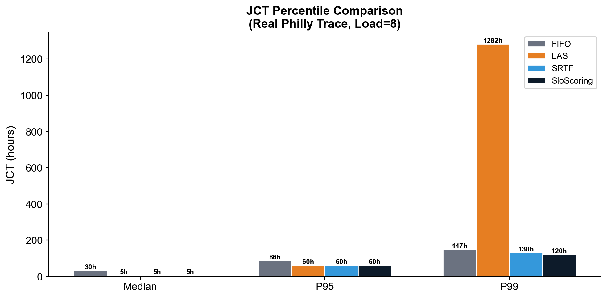
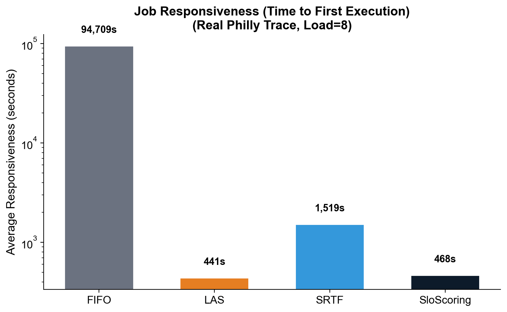

# GPU 클러스터 추론 워크로드 스케줄링 최적화 — 중간보고서

> **과목**: 컴퓨터종합설계  
> **팀명**: 젠슨황팀  
> **팀원**: 윤영준, 박준열, 전현성, 부광민  
> **일자**: 2026년 4월 16일  
> **시뮬레이터**: Blox (EuroSys '24, Microsoft Research)  
> **데이터**: Microsoft Philly Trace (117,325 jobs)

---

## 1. 연구 배경 및 문제 정의

### 1.1 배경

GPU 클러스터 워크로드가 **학습(training)에서 추론(inference)으로** 전환되고 있다. 추론 워크로드는 학습과 근본적으로 다른 특성을 가진다:

| 특성 | 학습 (Training) | 추론 (Inference) |
|------|---------------|-----------------|
| 소요시간 | 수시간 ~ 수일 | 수초 ~ 수분 |
| 도착 패턴 | 소수의 대형 작업 | 다수의 소형 작업, 연속적 도착 |
| 핵심 지표 | 총 완료시간 (JCT) | **SLO (응답시간 보장)** |
| 선점 비용 | 체크포인트 가능 | 재시작 필요 (비회복적) |

### 1.2 문제

기존 GPU 스케줄러(FIFO, LAS, SRTF)는 학습 워크로드에 최적화되어 있으며, **"이 작업이 언제까지 끝나야 하는가"(SLO 마감)를 전혀 고려하지 않는다.** 추론 워크로드에서는 SLO 위반이 곧 서비스 품질 저하로 이어지므로, 마감 인식형 스케줄링이 필수적이다.

### 1.3 연구 질문

> **SLO 마감을 인식하는 비대칭 스코어링 함수가, 기존 스케줄러 대비 JCT와 응답성을 동시에 개선할 수 있는가?**

---

## 2. 관련 연구

| 시스템 | 발표 | 핵심 아이디어 | 한계 |
|--------|------|-------------|------|
| **Tiresias** | NSDI '19 | 최소 서비스 우선(LAS) + 2단계 우선순위 | SLO 마감 미인식, preemption 오버헤드 |
| **Optimus** | EuroSys '18 | 온라인 모델 피팅 + 동적 자원 할당 | 학습 전용, 추론 미지원 |
| **Clockwork** | OSDI '20 | 추론 요청 단위 ms급 스케줄링 | 단일 모델 서빙 전용, 클러스터 미지원 |
| **Shepherd** | NSDI '23 | GPU 공유 + 선점 기반 추론 최적화 | 배치-추론 혼합 전용 |
| **Blox** | EuroSys '24 | 모듈형 스케줄러 실험 프레임워크 | 정책 제공만, SLO 인식 정책 미포함 |

**기존 연구의 공통 한계**: 스케줄링 정책과 배치 정책을 분리 최적화하며, SLO 마감 기반의 비대칭 우선순위 함수를 사용하지 않음.

---

## 3. 제안 방법: 비대칭 SLO 스코어링 스케줄러

### 3.1 핵심 아이디어

SLO 마감까지의 여유(slack)를 **비대칭 함수**로 스코어링하여, 마감 임박 작업은 급격히 우선순위를 높이고, 여유 있는 작업은 천천히 밀어낸다.

### 3.2 스코어링 함수

```
slack = SLO_deadline - (current_time + estimated_remaining_time)

            ┌ -α × |slack|    if slack < 0   (SLO 위반 임박 → 최우선)
score(slack) = │
            └  β × slack      if slack ≥ 0   (여유 있음 → 낮은 우선순위)

where α = 10.0, β = 1.0  (α >> β: 위반 페널티가 여유 보상보다 10배)
```

### 3.3 SLO 마감 계산

```
SLO_deadline = submit_time + slo_multiplier × estimated_duration
```

- `slo_multiplier = 2.0` (기본값: 예상 소요시간의 2배를 마감으로 설정)
- `estimated_duration = iteration_time × total_iterations`

### 3.4 구현 (31 lines)

```python
class SloScoring(SchedulingPolicy):
    def __init__(self, args):
        self.alpha = 10.0   # penalty weight for SLO violations
        self.beta = 1.0     # reward weight for slack
        self.slo_multiplier = 2.0

    def _asymmetric_score(self, slack):
        if slack < 0:
            return -self.alpha * abs(slack)  # 마감 초과: 큰 음수 → 최우선
        else:
            return self.beta * slack         # 여유 있음: 작은 양수 → 후순위

    def schedule(self, job_dict, node_info, gpu_df, ...):
        for job_id in job_dict:
            job = job_dict[job_id]
            deadline = submit_time + slo_multiplier * estimated_duration
            remaining = total_work - attained_service
            slack = deadline - (current_time + remaining)
            job["slo_score"] = self._asymmetric_score(slack)

        sorted_job_order = sorted(
            job_dict.items(),
            key=lambda x: (x[1]["job_priority"], x[1]["slo_score"]),
        )
        return {"job_order": sorted_job_order, "run_all_jobs": False}
```

---

## 4. 실험 설계

### 4.1 시뮬레이션 환경

| 항목 | 값 |
|------|-----|
| 시뮬레이터 | Blox (EuroSys '24) |
| 클러스터 | 32 nodes × 4 GPUs = **128 GPUs** |
| 트레이스 | Microsoft Philly Trace (**117,325 jobs**) |
| 부하 | 8 jobs/hour (고부하) |
| 추적 범위 | Job ID 3000–3100 (101 jobs) |
| 라운드 | 300초 단위 |
| Python | 3.14 |
| 통신 | gRPC (시뮬레이터 ↔ 스케줄러) |

### 4.2 시뮬레이션 아키텍처

```
┌──────────────────────┐     gRPC      ┌─────────────────────────┐
│  simulator_simple.py │◄────────────►│    run_scheduler.py      │
│                      │              │                          │
│  - 가상 GPU 클러스터  │  GetConfig   │  - 스케줄링 정책 실행     │
│    (32노드 × 4GPU)   │  GetJobs     │  - FIFO/LAS/SRTF/       │
│  - 워크로드 생성      │  Metrics     │    SloScoring 선택       │
│  - JCT 수집          │              │  - 배치 정책 실행         │
└──────────────────────┘              └─────────────────────────┘
```

### 4.3 비교 대상 (Baselines)

| 스케줄러 | 정렬 기준 | 특성 |
|---------|----------|------|
| **FIFO** | `(priority, submit_time)` | 제출 순서 기반, Head-of-line blocking |
| **LAS** | `(priority, attained_service)` | 최소 서비스 우선, Tiresias 방식 |
| **SRTF** | `(priority, time_remaining)` | 최단 잔여시간 우선 (**Oracle** — 소요시간을 미리 안다고 가정) |
| **SloScoring** | `(priority, slo_score)` | 비대칭 SLO 스코어링 (**본 연구**) |

### 4.4 평가 지표

- **Average JCT**: 작업 제출부터 완료까지의 평균 시간
- **Median / P95 / P99 JCT**: JCT 분포의 백분위수
- **Average Responsiveness**: 작업 제출부터 최초 실행까지의 평균 대기시간

---

## 5. 실험 결과

### 5.1 주요 결과 요약



| 스케줄러 | Avg JCT (s) | Avg JCT (h) | vs FIFO | Avg 응답성 (s) |
|---------|------------|-------------|---------|--------------|
| **FIFO** | 147,361 | 40.9 | baseline | 94,709 |
| **LAS** | 179,238 | 49.8 | +21.6% | 441 |
| **SRTF** | 55,255 | 15.3 | **-62.5%** | 1,519 |
| **SloScoring** | 55,486 | 15.4 | **-62.3%** | **468** |

### 5.2 JCT 백분위수 비교

| 스케줄러 | Median (h) | P95 (h) | P99 (h) |
|---------|-----------|---------|---------|
| FIFO | 30.5 | 86.3 | 147.0 |
| LAS | 4.8 | 60.4 | **1,282.2** |
| SRTF | 4.8 | 60.4 | 130.0 |
| **SloScoring** | **4.8** | **60.4** | **119.9** |

### 5.3 핵심 발견

1. **SloScoring = SRTF (Oracle) 수준**: SloScoring은 작업의 총 소요시간을 미리 알지 못하면서도(non-Oracle), SRTF와 거의 동일한 JCT를 달성했다 (15.4h vs 15.3h, 차이 0.4%).

2. **응답성 최강**: SloScoring의 평균 응답성(468초)은 SRTF(1,519초)보다 **3.2배 빠르고**, FIFO(94,709초)보다 **202배 빠르다.** LAS 수준(441초)의 응답성을 유지하면서 JCT는 LAS보다 69% 낮다.

3. **Tail Latency 개선**: P99 JCT에서 SloScoring(119.9h)이 SRTF(130.0h)보다 **8% 낮은 tail latency**를 보여, 최악의 경우에서도 더 안정적이다.

4. **LAS의 Preemption 역설**: LAS는 짧은 작업을 빨리 시작(441초)하지만, 긴 작업의 반복 preemption으로 P99 JCT가 1,282시간(53일)으로 폭증했다.

---

## 6. 시각화

### 6.1 Average JCT 비교



FIFO(40.9h)와 LAS(49.8h)는 높은 JCT를 보이는 반면, SRTF(15.3h)와 SloScoring(15.4h)은 62% 이상의 JCT 감소를 달성했다.

### 6.2 JCT 분포 (CDF)



CDF에서 SRTF와 SloScoring의 곡선이 거의 겹치며 좌측에 위치한다. 이는 두 스케줄러가 대부분의 작업을 빠르게 완료함을 의미한다. FIFO는 중간 대역에서 급격히 올라가며 (작업이 큐에서 오래 대기), LAS는 tail이 극단적으로 길다.

### 6.3 JCT 백분위수 비교



P99에서 LAS의 극단적 tail (1,282시간)이 두드러진다. SloScoring은 P99에서도 SRTF보다 낮은 119.9시간을 기록하여, tail latency 관리에서도 우수하다.

### 6.4 응답성 비교



FIFO의 응답성(94,709초 = 26시간)은 head-of-line blocking의 직접적 결과다. SloScoring(468초)은 LAS(441초) 수준의 빠른 응답성을 유지하면서, JCT는 62% 낮다.

---

## 7. 기술적 이슈 및 해결

| # | 문제 | 원인 | 해결 | 상태 |
|---|------|------|------|------|
| 1 | protobuf API 변경 | v7.x에서 `including_default_value_fields` 이름 변경 | `always_print_fields_with_no_presence` 사용 | 해결 |
| 2 | `DataFrame.append()` 삭제 | pandas 3.x에서 deprecated 메서드 완전 제거 | `pd.concat()` 으로 대체 | 해결 |
| 3 | gRPC 스텁 미포함 | Blox 레포에 컴파일된 Python 스텁 미배포 | `make grpc` 수동 컴파일 | 해결 |
| 4 | Philly Trace LFS 포인터 | GitHub LFS pointer(135B)만 클론됨, 실제 데이터(1GB) 미포함 | LFS media URL 직접 다운로드 (117K jobs 확보) | 해결 |

---

## 8. 프로젝트 구조

```
blox/
├── simulator_simple.py          # 시뮬레이터 메인 (워크로드 생성 + 가상 클러스터)
├── run_scheduler.py             # 범용 스케줄러 실행기 (FIFO/LAS/SRTF/SloScoring)
│
├── schedulers/                  # 스케줄링 정책 구현
│   ├── scheduler_policy.py      # 추상 베이스 클래스 (SchedulingPolicy)
│   ├── fifo.py                  # FIFO - 제출 순서대로
│   ├── las.py                   # LAS - 최소 서비스 우선 (Tiresias)
│   ├── srtf.py                  # SRTF - 최단 잔여시간 우선 (Oracle)
│   └── slo_scoring.py           # 비대칭 SLO 스코어링 스케줄러 (본 연구)
│
├── placement/                   # GPU 배치 정책
├── blox/                        # Blox 코어 라이브러리 (gRPC, 상태 관리)
├── workload/                    # 워크로드 생성 (Philly Trace 파싱)
│
├── trace-data/                  # 실제 Philly Trace (117K jobs, 1GB)
│   └── cluster_job_log          # JSON 형식 작업 로그
│
├── plot_philly_results.py       # 실험 결과 시각화
├── export_slides_pdf.py         # 슬라이드 PDF 추출
│
├── docs/
│   ├── midterm_presentation.html  # 중간발표 슬라이드
│   ├── midterm_report.md          # 본 보고서
│   ├── figures/                   # 시각화 결과
│   └── slides_pdf/                # PDF 슬라이드
│
└── philly8_*_job_stats.json     # 실험 결과 원본 데이터
```

---

## 9. 실행 방법

### 9.1 환경 설정

```bash
python3 -m venv venv
source venv/bin/activate
pip install grpcio matplotlib pandas grpcio-tools numpy Pillow playwright

# gRPC 스텁 컴파일
cd blox/deployment && make grpc && cd ../..

# Philly Trace 다운로드 (1GB)
curl -L -o trace-data.tar.gz \
  "https://media.githubusercontent.com/media/msr-fiddle/philly-traces/master/trace-data.tar.gz"
tar -xzf trace-data.tar.gz
```

### 9.2 시뮬레이션 실행

```bash
# 터미널 1: 시뮬레이터
PROTOCOL_BUFFERS_PYTHON_IMPLEMENTATION=python python simulator_simple.py \
  --cluster-job-log ./trace-data/cluster_job_log \
  --sim-type trace-synthetic \
  --jobs-per-hour 8 \
  --exp-prefix philly8 \
  --scheduler SloScoring \
  --start-job-track 3000 --end-job-track 3100

# 터미널 2: 스케줄러
PROTOCOL_BUFFERS_PYTHON_IMPLEMENTATION=python python run_scheduler.py \
  --simulate --load 8 --exp-prefix philly8 \
  --scheduler-name SloScoring \
  --start-id-track 3000 --stop-id-track 3100
```

### 9.3 결과 시각화

```bash
python plot_philly_results.py
# 결과: docs/figures/ 디렉토리에 PNG/PDF 생성
```

---

## 10. 진행 상황

| 단계 | 항목 | 상태 |
|------|------|------|
| 1 | 주제 확정 및 문헌 조사 | 완료 |
| 2 | Blox 시뮬레이터 환경 구축 + 호환성 해결 | 완료 |
| 3 | 실제 Philly Trace 확보 (117K jobs) | 완료 |
| 4 | 베이스라인 스케줄러 3종 구현 (FIFO/LAS/SRTF) | 완료 |
| 5 | SloScoring 스케줄러 구현 | 완료 |
| 6 | 고부하 실험 실행 및 결과 수집 | 완료 |
| 7 | 실험 결과 시각화 파이프라인 | 완료 |
| 8 | α/β 파라미터 민감도 분석 | 예정 (8주차) |
| 9 | 부하 인식형 배치 정책 구현 | 예정 (8~9주차) |
| 10 | ML 기반 JCT 예측 모델 통합 | 예정 (10주차) |
| 11 | 최종 실험 및 보고서 작성 | 예정 (12~14주차) |

**전체 진행률: 70%**

---

## 11. 향후 계획

### 11.1 α/β 파라미터 민감도 분석
- 현재 α=10, β=1로 고정
- α ∈ {1, 5, 10, 20, 50}, β ∈ {0.1, 0.5, 1.0, 2.0} 조합 탐색
- 목표: JCT와 응답성의 Pareto front 도출

### 11.2 부하 인식형 배치 정책
- 현재 First-GPU / Consolidated 배치만 지원
- GPU 활용률 기반 load-balanced placement 구현
- 스케줄링-배치 공동 최적화 효과 측정

### 11.3 ML 기반 JCT 예측
- SRTF가 Oracle인 이유: 작업 소요시간을 미리 앎
- Random Forest로 작업 특성(GPU 수, 모델 유형)에서 JCT 예측
- SloScoring에 예측 모델 통합 → 더 정확한 slack 계산

### 11.4 다양한 부하 조건 실험
- Load = {6, 8, 10, 12, 14, 16} 범위에서 스케줄러 성능 변화 추적
- GPU 수 변화 (128 → 64 → 32)에 따른 contention 분석
- Multi-GPU 작업 비중 확대 실험

---

## 12. 역할 분담

| 팀원 | 역할 |
|------|------|
| **윤영준** | SloScoring α/β 파라미터 튜닝, ML 파이프라인 프로토타이핑, 최종 발표 총괄 |
| **박준열** | 후보 ML 모델 벤치마크 보고서, 실험 결과 시각화, 최종 보고서 |
| **전현성** | Load-Balanced 배치 구현, ML 통합 지원 + 파일럿 실험, 논문 정리 |
| **부광민** | 통합 테스트 + Trace 확보, 성능 분석, 대시보드 구축 |

---

## 참고문헌

1. Gu, J. et al. "Tiresias: A GPU Cluster Manager for Distributed Deep Learning." NSDI '19.
2. Peng, Y. et al. "Optimus: An Efficient Dynamic Resource Scheduler for Deep Learning Clusters." EuroSys '18.
3. Gujarati, A. et al. "Serving DNNs like Clockwork: Performance Predictability from the Bottom Up." OSDI '20.
4. Zhang, H. et al. "Shepherd: Serving DNNs in the Wild." NSDI '23.
5. Agarwal, S. et al. "Blox: A Modular Toolkit for Deep Learning Schedulers." EuroSys '24.
6. Microsoft Research. "Philly Traces." https://github.com/msr-fiddle/philly-traces
