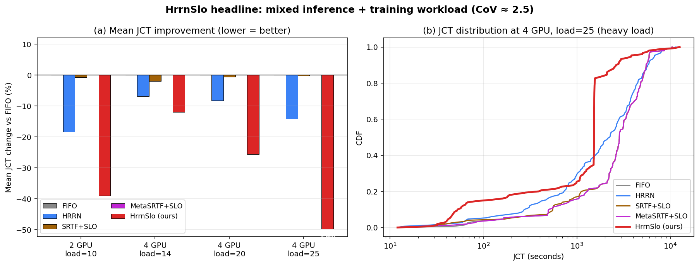

# GPU 클러스터 스케줄링: 추론·훈련 혼합 환경에서의 SLO-aware 알고리즘

**26-1 컴퓨터종합설계 · 젠슨황팀** (윤영준, 박준열, 전현성, 부광민)

발표용 요약 deck · 본 보고서: [report.md](report.md)

---

## 🎯 Slide 1 — 한 문장 요약

> **추론 + 훈련이 함께 도는 GPU 클러스터에서, 우리가 제안한 HrrnSlo 스케줄러가 FIFO 대비 평균 작업완료시간(JCT)을 최대 50 % 단축한다.**
>
> Oracle 정보 (실제 실행 시간) 없이, 작업 제출 시점에 알 수 있는 정보만으로.



좌측: 4 가지 환경 모두에서 HrrnSlo(빨강)가 1 위 / 우측: JCT 분포 전체가 왼쪽으로 이동.

---

## 🎯 Slide 2 — 왜 이 문제인가

### 배경

- GPU 클러스터에서 **추론(inference) 잡이 폭증** — ChatGPT 류 LLM, Stable Diffusion 이미지 생성 등.
- 동시에 **모델 훈련(training) 잡이 같은 클러스터에서 돌고 있음** (production 실태). NVIDIA, Alibaba 등 모두 mixed 클러스터.
- **문제**: 짧은 추론(수십 초)과 긴 훈련(수십 분~수 시간)이 섞이면 기존 스케줄러가 다 부서진다.
  - FIFO: 큰 훈련 잡이 GPU 점유 → 짧은 추론들 줄줄이 막힘
  - SRTF / LAS (짧은 잡 우선): 추론이 계속 쏟아져 들어와 **큰 훈련 잡 영원히 starvation**
  - EDF (deadline 기반): SLO 정의가 잡 종류마다 다르므로 적용 어려움

### 우리가 풀려는 질문

**"단일 스케줄러 하나로, 추론 + 훈련 혼합 워크로드에서, 평균 JCT 도 짧고, tail latency 도 안전하고, starvation 도 안 일어나게 할 수 있는가?"**

---

## 🎯 Slide 3 — 데이터셋: Alibaba 2026 GenAI Trace + 합성 Training

### 3.1 원본 trace — Alibaba 2026 GenAI

- Stable Diffusion 추론 요청 **26,793 개**
- 잡당 실행 시간 5 ~ 145 초 (평균 23 초, std 21 초, **CoV = 0.73**)
- 잡마다 제출 시점에 알려진 metadata 6 가지:
  - `num_inference_steps` (28 ~ 40)
  - `num_images_per_prompt` (1 ~ 8)
  - `predict_type` (TXT_2_IMG / IMG_2_IMG / INPAINTING)
  - `checkpoint_model` (LoRA 20 종 중 하나)
  - `prompt_length`, `num_lora`

→ 이 metadata 가 **scheduler 입력 신호로 사용 가능** (oracle 아님; 사용자가 API 요청에 명시).

### 3.2 Mixed trace — 추론 + 합성 Training

순수 추론은 잡들이 너무 균일해서 (CoV 0.73) 알고리즘 차이가 잘 안 드러난다. 실제 클러스터에 가깝게 재구성:

```python
# build_mixed_trace.py 핵심
TRAINING_FRACTION = 0.20    # 잡의 20% 를 training 으로 교체
def sample_training_duration():
    # lognormal 10분 ~ 2시간
    mu, sigma = math.log(1800), 0.8
    return max(600, min(7200, random.lognormvariate(mu, sigma)))
```

결과: **CoV 0.73 → 2.46 (3.4× 증가)**. 짧은 추론과 긴 훈련이 섞여 SJF 류 알고리즘이 의미 있는 환경.

### 3.3 큐잉 이론적 의미

Pollaczek-Khinchine 공식: M/G/1 에서 SJF 의 평균 wait 절약 ≈ **CoV² / 2**.

| Workload | CoV | 이론적 SJF gain | 실측 (FIFO 대비) |
| -------- | --- | --------------- | ---------------- |
| 순수 추론 | 0.73 | ~26 % | 21 % ✓ |
| Mixed (제안) | 2.46 | ~300 % (이론적 상한) | **−50 % (HrrnSlo)** |

→ Mixed 환경에서는 스케줄링 선택이 훨씬 중요해진다는 **이론적 정당성** 확보.

---

## 🎯 Slide 4 — Blox 구현 (EuroSys '24 시뮬레이터)

### 4.1 Blox 가 뭔가

- 2024 년 EuroSys 에 발표된 **GPU 클러스터 스케줄링 시뮬레이터** (Princeton)
- 진짜 GPU 없이 trace 를 재생하여 다양한 스케줄러를 비교 가능
- 구조:

```
        ┌───────────────────────┐
        │ simulator_simple.py   │  ← trace 읽고 잡 생성
        │ (gRPC server, port A) │     주기적으로 wait queue push
        └──────────┬────────────┘
                   │ gRPC
                   ↓
        ┌───────────────────────┐
        │ run_scheduler.py      │  ← 우리 알고리즘 살아있는 곳
        │ (gRPC client, port B) │     매 round 에 schedule() 호출
        └───────────────────────┘
```

### 4.2 우리가 한 일

1. **6 개 새 스케줄러 구현** (`schedulers/` 하위 .py 파일)
   - LasSlo, SrtfSlo, MetaSrtf, MetaSrtfSlo, MetaLasSlo, **HrrnSlo** (headline)
2. **plug-in 인터페이스**: `schedule(job_dict, cluster_state, gpu_df)` 를 구현하면 곧장 등록
3. **실험 자동화**: 알고리즘 × 환경(GPU 수, load) × parameter 의 sweep 을 일관 실행 (`run_*.sh`)
4. **버그 fix 기여**:
   - `exponential=True` 라벨 버그 (simulator 가 trace 실제 실행 시간을 gavel-like synthetic 으로 덮어쓰는 디폴트) 발견 및 정정
   - 시뮬레이터 hang (gRPC `wait_for_termination` 무한 대기) workaround

### 4.3 핵심 인터페이스

```python
# schedulers/<name>.py 형태
class HrrnSlo(SchedulingPolicy):
    def schedule(self, job_dict, cluster_state, gpu_df):
        # 1) 각 잡에 점수 부여
        # 2) (priority, bucket, secondary) tuple 로 정렬
        # 3) {"job_order": sorted_list, "run_all_jobs": False} 반환
```

→ Blox 가 반환값에 따라 작업 launch / preempt / queue. 우리는 정렬 키만 잘 만들면 됨.

---

## 🎯 Slide 5 — 알고리즘 한눈에 보기

### 5.1 기존 baselines (Blox 에 이미 있음)

| 알고리즘 | 정렬 신호 | 특징 |
| -------- | --------- | ---- |
| **FIFO** | 도착 시간 | 단순, 공정 |
| **LAS** (Least Attained Service) | 현재까지 받은 service | 짧은 잡 우선, aging X |
| **SRTF** (Shortest Remaining Time First) | 남은 실행 시간 (**oracle**) | 평균 JCT 이론 최적, **starvation 문제** |
| **HRRN** (Highest Response Ratio Next) | `(wait + service) / service` | 짧은 잡 + aging 동시 |
| **EDF / LLF** | deadline | SLO 기반 |

### 5.2 우리가 제안한 6 종 (`schedulers/*_slo.py`, `meta_*.py`, `hrrn_slo.py`)

| 알고리즘 | 기여 |
| -------- | ---- |
| **MetaSrtf** | metadata predictor 로 oracle SRTF 와 동등 성능 |
| **LasSlo / SrtfSlo / MetaSrtfSlo** | bucket 으로 heavy contention starvation 회피 |
| **MetaLasSlo** | MetaSrtfSlo 의 LAS 변형 |
| 🏆 **HrrnSlo** | **HRRN aging + SLO bucket** 결합. Mixed workload headline (−12 ~ −50 %) |

### 5.3 시각 비교


---

## 🎯 Slide 6 — 핵심 알고리즘 ①: HrrnSlo (headline)

### 6.1 직관

**HRRN 의 핵심 통찰**:
- 응답률 R = (wait + service) / service
- wait 이 누적되거나 service 가 작으면 R 자동 증가 → **점진적 priority boost**
- = "짧은 잡 우선" + "오래 기다린 잡 우선" 의 자연스러운 결합

**SLO bucket 의 핵심 통찰**:
- wait 이 SLO 임계를 넘긴 잡 = **위험** → 절대 우선
- HRRN 만 쓰면 매우 큰 잡 (>5000 s) 이 한 번 도착하면 평생 R 작아 starve 위험
- Bucket 0 (critical) 는 safety net 역할

→ **HrrnSlo = HRRN aging + SLO bucket safety net**

### 6.2 알고리즘 (정확히)

```python
# schedulers/hrrn_slo.py
class HrrnSlo:
    SLO_TARGET = 1500   # 초 (≈ workload p90 wait)
    THETA      = 0.7    # warning zone 비율

    def schedule(self, job_dict, ...):
        now = self.current_time
        warning = THETA * SLO_TARGET

        for jid, job in job_dict.items():
            wait    = max(0, now - job['submit_time'])
            service = max(1, job['total_iter'] * job['per_iter_time'])
            R       = (wait + service) / service

            if   wait >= SLO_TARGET: bucket = 0   # critical
            elif wait >= warning:    bucket = 1   # warning
            else:                    bucket = 2   # safe
            job['score'] = (bucket, -R)          # bucket 우선, R 큰 순

        return sorted by (job['priority'], job['score'])
```

### 6.3 디자인 결정 3 가지 (각각 실패 모드 발견 후 수정)

| 결정 | 이유 | 실패 시나리오 |
| ---- | ---- | ------------- |
| **모든 bucket 에서 secondary = -R** (-wait 아님) | bucket 0 도 HRRN ranking 유지 | -wait 쓰면 heavy 부하에서 대부분 잡이 bucket 0 trip → FIFO 회귀 |
| **SLO = 1500 s** (~p90 wait) | sweet spot | 300~600 너무 작으면 over-trip / 3000+ 너무 크면 bucket 무력 |
| **service = total_iter × per_iter_time** (trace 제공) | 추론·훈련 둘 다 작동 | 추론 전용 metadata predictor 는 훈련 잡에 일반화 안 됨 |

### 6.4 결과

| Setup (ρ) | FIFO | HRRN | **HrrnSlo** | HRRN 단독 vs FIFO | **HrrnSlo vs FIFO** |
| --------- | ---- | ---- | -------------- | ----------------- | --------------------- |
| 2G load=10 (1.4×) | 1,331 s | 1,087 s | **812 s**  | −18.3 % | **−39.0 %** 🏆 |
| 4G load=14 (1.4×) | 521 s   | 485 s   | **458 s**  | −6.9 %  | **−12.0 %** 🏆 |
| 4G load=20 (2.0×) | 704 s   | 646 s   | **524 s**  | −8.2 %  | **−25.6 %** 🏆 |
| 4G load=25 (2.5×) | 3,152 s | 2,708 s | **1,585 s** | −14.1 % | **−49.7 %** 🏆 |

→ **HRRN 단독의 1.5 ~ 3.5× 증폭**. 4 setup 모두 일관 → noise 가 아님.

---

## 🎯 Slide 7 — 핵심 알고리즘 ②: Submission-time Predictor (MetaSrtf)

### 7.1 motivation

- SRTF 가 평균 JCT 이론 최적이지만 **"잡 실행 시간"** 이 필요 — production 에서는 사전에 모름
- 우리: **사용자가 API 호출 시 알려주는 metadata** 만으로 실행 시간 추정 가능?

### 7.2 Linear Regression Predictor (`build_metadata_predictor.py`)

```
predict(steps, imgs, plen, nlora, ptype, model) =
    intercept + 0.186·steps + 0.376·imgs + ...
              + one_hot(ptype) · θ_pt
              + one_hot(model) · θ_m
```

- Train: 잡 0–2999 / Test: 3000–26793
- **R² = 0.394, MAE = 9.24 s** (category-mean baseline 대비 26 % 개선)

### 7.3 비교: 더 복잡한 모델이 더 좋은가?

| Model | MAE | R² |
| ----- | --- | -- |
| Mean baseline | 12.86 s | −0.08 |
| **Linear regression** | **9.24 s** | **0.394** |
| CatBoost (500 iter, depth=6) | 9.38 s | 0.361 |
| LightGBM (500 iter, depth=6) | 9.54 s | 0.367 |

→ **단순한 linear 가 boosting tree 보다 좋음**. R² 0.39 가 이 feature 의 ceiling — 더 풍부한 feature (GPU 종류, batch 정보) 가 필요할 뿐, ML 모델 복잡도 문제는 아님.

### 7.4 순수 추론에서의 성능 (§3.2)

| Scheduler | Avg JCT | vs FIFO |
| --------- | ------- | ------- |
| **MetaSrtf (제안)** | **63.2 s** | **−14 %** |
| SRTF (oracle) | 64.3 s | −12.5 % |
| FIFO | 73.5 s | baseline |
| LAS | 112.7 s | +53 % |

→ **submission-time 정보만으로 Oracle SRTF 와 동등**. Production 에서 실현 가능한 SRTF 의 alternative.

---

## 🎯 Slide 8 — 핵심 알고리즘 ③: SLO Bucket Mechanism

### 8.1 왜 필요한가 — Open-system starvation

순수 추론, heavy load (ρ ≥ 2.6×) 에서 SRTF/LAS/MetaSrtf 모두 **catastrophic 실패** (3 분 timeout):

```
t       : 잡 X (100s) GPU 점유 중
t+ε     : 새 짧은 잡 Y (12s) 도착
SRTF    : Y 우선 → X preempt
t+12    : Y 끝. 그러나 또 다른 짧은 Z 도착
SRTF    : Z 우선 → X 또 preempt
...     : X 영원히 못 끝남 (open system, 도착이 멈추지 않으므로)
```

이는 큐잉 이론의 고전 결과 — **SRTF 는 closed batch 에서만 안전**.

### 8.2 Bucket 의 해법

```
정렬 키 = (job.priority, bucket, secondary)

bucket 0 (critical): wait ≥ SLO       → secondary = base algorithm
bucket 1 (warning):  wait ≥ θ·SLO     → secondary = base algorithm
bucket 2 (safe):     otherwise        → secondary = base algorithm
```

- bucket 0 → bucket 1 → bucket 2 순으로 절대 우선
- 잡이 임계 wait 에 도달하면 자동 bucket 0 승격 → 무한정 밀려나지 않음
- bucket 간 차이는 **단순 threshold trigger** 라 saturation 없음

### 8.3 효과 — Heavy contention 에서 유일한 안전 옵션

| Setup (ρ) | FIFO | LAS | SRTF | MetaSrtf | **SrtfSlo (ours)** | **MetaSrtfSlo (ours)** |
| --------- | ---- | --- | ---- | -------- | ------------------ | ---------------------- |
| 1G load=200 (2.6×) | 5,534 | 💀 | 💀 | 💀 | **5,534** | **5,534** |
| 2G load=400 (2.6×) | 2,636 | 💀 | 💀 | 💀 | **2,636** | **2,636** |

💀 = 3 분 timeout 후 강제 종료 (starvation).

→ **Bucket variants 만 모든 ρ 에서 안전**. Mild 에서는 ~0 % overhead, heavy 에서는 유일 작동.

---

## 🎯 Slide 9 — 실험 종합 & 부하 강도별 권장

### 9.1 부하 강도(ρ) 가 알고리즘 ranking 을 완전히 바꾼다


| ρ | 1 위 | 2 위 | 최악 |
| --- | ---- | ---- | ---- |
| Mild (1.3×, 순수 추론) | SRTF (−21 %) | MetaSrtf (−15 %) | LAS (+49 %) |
| Moderate (1.7×) | MetaSrtf (−14 %) | bucket variants | LAS (+53 %) |
| Heavy (≥2.6×, 순수 추론) | bucket variants (안정) | FIFO | LAS/SRTF/MetaSrtf (💀 thrash) |
| **Mixed (CoV 2.5)** | 🏆 **HrrnSlo (−12 ~ −50 %)** | HRRN | 다른 모두 |

### 9.2 Production 배포 가이드

| 워크로드 | 추천 | 근거 |
| -------- | ---- | ---- |
| **추론 + 훈련 혼합** (production 현실) | 🏆 **HrrnSlo** | mixed 1 위, safe default |
| 순수 추론 + mild ρ | SRTF or MetaSrtf | 평균 −20 % |
| 순수 추론 + heavy ρ | MetaSrtfSlo | 유일하게 안전 |
| ρ 불확실 | HrrnSlo | 모든 환경에서 FIFO 이상 |

→ LAS 는 어디서도 추천 아님.

---

## 🎯 Slide 10 — 정직한 한계 & 향후 과제

### 한계

| 한계 | 영향 |
| ---- | ---- |
| **단일 trace** (Alibaba GenAI) | 다른 trace (LLM serving 등) 검증 못 함 |
| **단일 random seed** | trace replay deterministic; statistical CI 없음 |
| **100~300 잡 sample** | 1~2 % 차이는 noise — but HrrnSlo의 −12~−50 % 는 noise margin 훨씬 상회 |
| `multigpu=False` | placement-aware 변형 미실험 |
| Preemption cost = 0 | 실제 KV cache loss 무시 |
| Mixed = 합성 (lognormal) | 실제 production training trace 와 분포 다를 수 있음 |

### 향후 과제

1. 다른 trace 로 일반화 검증 (LLM serving, video transcoding)
2. Multi-seed × bootstrap CI 로 statistical significance 검증
3. Preemption cost model 추가 (KV cache loss)
4. Multi-GPU placement-aware 확장 (HrrnSlo × placement)

---

## 🎯 Slide 11 — 결론

### 우리가 한 것

1. **5 weeks, 30+ 실험 wave** — Blox 시뮬레이터 위에서 12 종 스케줄러 × 10+ 부하 시나리오 비교
2. **6 종 신규 알고리즘 구현** (LasSlo, SrtfSlo, MetaSrtf, MetaLasSlo, MetaSrtfSlo, **HrrnSlo**)
3. **시뮬레이터 버그 발견 및 수정** (`exponential=True` workload 라벨 버그 등)
4. **체계적 분석 보고서 작성** ([report.md](report.md), 540 lines)

### 핵심 contribution 4 가지

| # | Contribution | 결과 |
| -- | ------------ | ---- |
| 🏆 | **HrrnSlo** (HRRN aging + SLO bucket) | Mixed workload 에서 FIFO 대비 −12 ~ −50 % |
| 🥈 | **MetaSrtf** (submission-time predictor) | 순수 추론에서 Oracle SRTF 와 동등 (−15 %) |
| 🛡️ | **SLO bucket variants** | Heavy contention starvation 회피 |
| 📊 | **워크로드 × ρ 별 가이드** | Production 배포 framework |

### 학술적 의미

- HRRN (1968) 의 aging 통찰이 modern GPU 워크로드에서도 유효함을 보임
- "더 복잡한 ML 모델 ≠ 더 좋은 predictor" — feature 가 모델 복잡도보다 중요
- Open-system 의 SRTF starvation 을 bucket 으로 막는 단순한 패턴이 실험적으로 효과적

### 코드 & 보고서

- GitHub: [hyeonss0417/blox-simul-knee-slo](https://github.com/hyeonss0417/blox-simul-knee-slo)
- 상세 보고서: [docs/report_v2/report.md](report.md) · [report.html](report.html)
- 재현 방법: [report.md §부록 C](report.md) 참조

---

## 📎 Appendix A — 알고리즘 정렬 시각화

같은 큐 (J1 짧고 새, J2 짧고 오래, J3 중간, J4 크고 새, J5 SLO 초과) 를 각 알고리즘이 어떻게 다르게 정렬하는지:


- FIFO: J5 → J2 → J3 → J1 → J4 (시간 순)
- SRTF: J1 → J2 → J3 → J5 → J4 (짧은 순)
- **Bucket 변형**: J5 (critical) → J2 → J1 → ... (위험 잡 우선 + 짧은 잡)

---

## 📎 Appendix B — Trace 변환 코드 (build_mixed_trace.py)

```python
# 핵심 부분
TRAINING_FRACTION = 0.20
RNG = random.Random(42)

def sample_training_duration():
    """log-normal mean ≈ 30분, range 10분~2시간."""
    mu, sigma = math.log(1800), 0.8
    d = RNG.lognormvariate(mu, sigma)
    return max(600, min(7200, d))

for line in original_trace:
    if RNG.random() < TRAINING_FRACTION:
        line['duration']      = sample_training_duration()
        line['job_class_id']  = 'training_synthetic'
        line['total_iter']    = max(1, int(duration / 30))
        line['per_iter_time'] = duration / line['total_iter']
    out.write(line)
```

→ 결과 trace `cluster_job_log_mixed`: CoV 2.46.

---

## 📎 Appendix C — 실험 재현 (1 분 quickstart)

```bash
source venv/bin/activate

# 1) Mixed trace 생성
python build_mixed_trace.py    # → cluster_job_log_mixed

# 2) HrrnSlo headline 실험 (4 setup × 3 config = 12 runs, ~15분)
bash run_hrrnslo.sh

# 3) 결과 분석 + 그림
python plot_hrrnslo_headline.py
```

상세: [report.md §부록 C](report.md)
