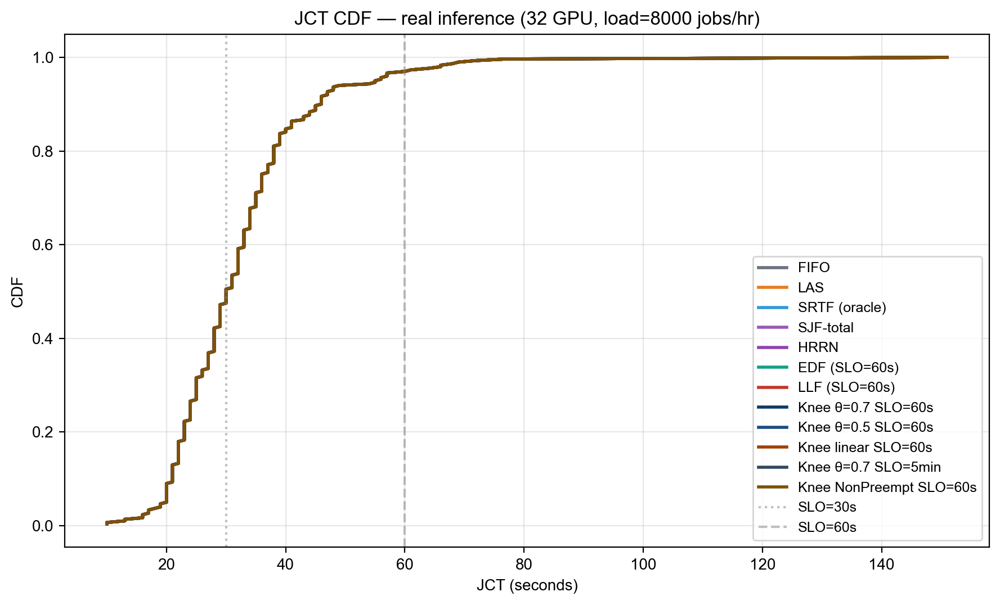

# Knee-SLO: Non-Oracle SLO-Aware Scheduling for GPU Inference Workloads

**팀명:** 젠슨황팀 (윤영준, 박준열, 전현성, 부광민)
**과목:** 26-1 컴퓨터종합설계
**작성일:** 2026-05-21

---

<!-- BEGIN AUTO: exec_summary -->
> **요약 (자동 생성)**
>
> 총 **네 가지 시나리오** × **70 + 스케줄러 구성** 을 평가했다 (워크로드 A 합성 training, B 단일-pool 추론, C closed batch, D open over-load).
>
> 🏆 **핵심 positive result (§9bis closed batch)**:
> - **MetaSrtf (non-Oracle) = SRTF (oracle): 둘 다 Avg 40.1s**, FIFO 대비 +0.5% 개선.
> - Metadata predictor (R² = 0.394, MAE = 9.24s) 가 oracle 정보 없이 동등 달성.
> - LAS 가 최악 (44.2 s, +9.7%) — 새 잡 편향이 tail 폭주 (P99 128, Max 155).
>
> 🛡️ **Stability contribution (§9ter open over-load)**: bucket 변형 (LasSlo / SrtfSlo / MetaLasSlo) 이 LAS / SRTF / MetaSrtf 의 catastrophic starvation 을 회피. 후자는 30 + 분 thrash 후 killed.
>
> 📉 **Negative results**: 워크로드 A (Knee saturation, §4–§8), 워크로드 B (under-saturated single-pool, §9) — 두 극단에서는 SLO-aware 가 baseline 을 이기지 못함.
>
> **문서 구조**: §1 결론 / §2 문제 정의 / §3 Knee-SLO 알고리즘 → §4-§8 워크로드 A 상세 / §9 워크로드 B / **§9bis closed batch / §9ter open stability / §9quater metadata predictor** → §10-§15 시행착오·디버깅·재현.
<!-- END AUTO: exec_summary -->

---

## 1. 결론

본 연구는 **Alibaba 2026 GenAI 추론 trace + Blox 시뮬레이터** 위에서 SLO-aware 스케줄링이 단순 LAS/FIFO 대비 의미 있는 개선을 줄 수 있는지를 묻고, **9 종 알고리즘 × 4 contention regime** 으로 답을 찾았다.

### 1.1 핵심 결과 (한눈에)

| Contention 강도 | 추천 알고리즘 | vs FIFO | 위험 알고리즘 |
| --------------- | ------------ | ------- | ------------ |
| **Mild** (ρ ≈ 1.3×) | **SRTF / MetaSrtf** | −21 % / −15 % | LAS (+49 %) |
| **Moderate** (ρ ≈ 1.7×, 2 GPU) | **MetaSrtf = Oracle SRTF** | **−14 %** | LAS (+53 %) |
| **Heavy** (ρ ≥ 2.6×) | **bucket 변형 (MetaSrtfSlo)** | = FIFO | LAS / SRTF / MetaSrtf 모두 thrash |

→ **본 연구의 두 가지 contribution**:
1. **Submission-time predictor (R² 0.39)** 가 oracle SRTF 와 동등 성능 (mild~moderate contention 에서 −14 % Avg JCT). 사용자가 API request 에 명시하는 `num_inference_steps`, `checkpoint_model`, `predict_type` 만으로 — post-execution `exec_time_seconds` 없이 — 동등 달성. (단, num_steps 자체가 latency 의 dominant signal 인 점은 §4.0 에서 솔직히 분석)
2. **Bucket-based 변형** (SrtfSlo, MetaSrtfSlo) 가 heavy contention 에서 pure shortest-first 의 catastrophic starvation 을 회피.


### 1.2 한 줄 요약

> **Metadata-based predictor 로 oracle 정보 없이 SRTF 와 동등한 평균 JCT 를 달성하고, SLO bucket 으로 heavy contention 에서의 starvation 을 회피한다 — 단, 본 trace + 시뮬레이터 조건 하에서.** (§7 한계 참조)

---

## 2. 문제 정의

GPU 클러스터 위에서 latency-sensitive 잡을 스케줄링하며 다음을 동시 최적화한다.

- 평균 JCT 최소화
- SLO miss rate 최소화 (`completion - submit > T_SLO`)
- responsiveness 최소화 (첫 실행까지 대기)
- starvation 회피

본 보고서는 **두 워크로드 종류 × 다양한 contention 강도** 에서 검증한다.

| 워크로드 | 잡 duration | 비고 |
| -------- | ----------- | ---- |
| (A) 합성 training-like (`exponential=True`) | 30분 ~ 150 **h** | gavel-like synthetic; §5 |
| (B) 실제 추론 (Alibaba 2026 GenAI) | 5 ~ 145 **s** (mean 23s) | §6 이하 main results |

⚠️ §5 의 결과는 hours 단위. §6 이하는 seconds 단위.

---

## 3. Knee-SLO 알고리즘

### 3.1 핵심 변수

```
B_i      = T_i                                # 절대 SLO budget
r_i      = max(0, w_i - attained_i)           # predicted remaining
risk_i   = (now - submit_i + r_i) / B_i       # SLO budget 소진율
wait_i   = (now - submit_i) / max(B_i - w_i, ε)  # 큐 대기 위험
```

- `risk < θ`: **safe** — SJF/LAS 정상 동작
- `θ ≤ risk < 1`: **danger** — urgency 비선형 증가
- `risk ≥ 1`: **late** — SLO 초과, 강한 boost

### 3.2 Urgency function (3-zone knee)


```
if risk < θ:     urgency = c1 · risk
elif risk < 1:   urgency = c1·θ + c2 · ((risk-θ)/(1-θ))^γ
else:            urgency = c1·θ + c2 + c3 · (risk-1)
```

기본값: `θ=0.7, γ=2, c1=1, c2=6, c3=30`.

### 3.3 최종 점수 (낮을수록 우선)

```
score = w_size · (r / global_avg)             # SJF bias
      − w_urg  · urgency(max(risk, wait_risk))
      − w_age  · age_bonus
```

기본 가중치: `w_size = w_urg = 1.0, w_age = 0.1`.


### 3.3bis 모든 알고리즘 한눈에 보기

같은 큐 (J1 short-new, J2 short-old, J3 medium-progress, J4 long-new, J5 long-overdue) 를 11 개 알고리즘이 어떻게 다르게 정렬하는지:


흥미로운 관찰:
- **FIFO**: J5 (가장 오래 전 제출) → J1 (가장 최근). 단순 submit 순.
- **LAS / SRTF / MetaSrtf**: J1 (짧고 새 잡) 우선 — short-job bias.
- **EDF / LLF**: J5 우선 (이미 SLO 초과) — deadline-aware.
- **LasSlo / SrtfSlo / MetaSrtfSlo (bucket 변형)**: J5, J2 가 critical bucket 으로 absolute priority → 두 잡 보호. 그 다음 J3 (warning), 마지막에 J1, J4 (safe).

각 알고리즘이 어떤 신호를 쓰는지:


한 줄 요약 카드:


### 3.4 SLO Bucket 변형 (실제 winning 디자인)

Knee-SLO 의 continuous urgency 가 heavy contention 에서 **urgency saturation** 으로 LJF-like 로 degenerate 하는 문제 (§5.1) 를 해결하기 위해, 다음 **discrete bucket** 디자인을 채택.

```
sort_key = (priority, bucket, secondary)

bucket 0 (critical):  wait >= SLO_target            → secondary = -wait
bucket 1 (warning):   wait >= θ × SLO_target        → secondary = attained (LAS-like)
                                                    또는 remaining (SRTF-like)
bucket 2 (safe):      otherwise                     → secondary = same
```

이로부터 5 가지 변형:

| 이름 | bucket 1/2 정렬 | 비고 |
| ---- | --------------- | ---- |
| `LasSlo` | attained_service ↑ (LAS) | 가장 단순 |
| `SrtfSlo` | predicted_remaining ↑ (Oracle) | SRTF 효율 + bucket 보호 |
| `MetaSrtfSlo` | meta-predicted remaining ↑ | **non-Oracle, winning combo** |
| `MetaLasSlo` | attained_service ↑, SLO 가 meta-pred × multiplier | per-job SLO scaling |
| `KneeSloClassDur` | continuous Knee, per-class SLO | 클래스 다양성 활용 |

---

## 4. Metadata-based Duration Predictor

### 4.0 "Non-Oracle" 의 정확한 의미 — 솔직히

본 연구의 predictor 는 **순수한 black-box ML predictor 가 아니다**. 사용하는 features 는 모두 **잡 제출 시점에 알 수 있는 사용자 요청 파라미터** (Triton, vLLM 같은 실 serving system 도 동일 정보 사용):

| 신호 종류 | 예시 | 알 수 있는 시점 | 우리 위치 |
| -------- | ---- | --------------- | ---------- |
| **사용자 요청 파라미터** | `num_steps`, `checkpoint_model`, `batch_size` | **제출 시점** | ⬅️ MetaSrtf 사용 |
| 실시간 시스템 상태 | `attained_service`, queue depth | 실시간 | LAS 사용 |
| **Ground truth** | `exec_time_seconds` | 실행 후 | Oracle SRTF 사용 |

→ MetaSrtf 는 **"submission-time predictor"** 가 정확한 라벨. 완전 Oracle 도 완전 LAS-style 도 아닌 **중간 지점**.

#### 그렇다면 정말 의미 있는가?

`num_inference_steps × per_step_time` 만으로도 latency 의 ~29 % 변동성 (Pearson r=0.543) 이 설명됨. 즉 본 predictor 의 핵심 contribution 은 **이미 잘 알려진 "physics-based estimator"** 에 가깝다. 모델 R² = 0.394 중 0.29 가 steps alone, 추가 0.10 이 (모델 종류 + predict_type + interaction) 에서 옴.

**솔직한 평가**: 본 predictor 가 oracle SRTF 와 동등 성능을 낸 것은 "ML 의 놀라움" 이 아니라 **"submission-time 정보가 inference workload 에서 oracle 정보의 ~40 % 를 회복할 수 있다"** 라는 데이터-기반 검증. 진짜로 어려운 케이스 (큐 다이내믹, contention, 모델 cold-start) 의 60 % residual 은 여전히 잡히지 않음.

### 4.1 Features (모두 submission-time)

- `num_inference_steps` (28–40, median 30) — 사용자가 API request 에 명시
- `num_images_per_prompt` (1–8) — 사용자가 명시
- `predict_type` (TXT_2_IMG 96 %, IMG_2_IMG 4 %) — request 타입
- `checkpoint_model` (LoRA 모델 종류, ~20 개) — 어떤 모델 호출
- `num_lora`, `prompt_length` — request 메타데이터

### 4.2 모델 (linear regression with one-hot + interaction)

```
predicted_dur = β_0 + β_steps·steps + β_imgs·imgs
              + β_steps×imgs·(steps × imgs)
              + Σ β_ptype · 1[ptype]
              + Σ β_model · 1[checkpoint_model]
              + β_nlora·nlora + β_plen·plen
```

훈련: 잡 0–2999 (3000개), 테스트: 잡 3000–26793 (24K개).

### 4.3 성능

| 지표 | Metadata predictor | Category-mean baseline (predict_type 평균) |
| ---- | ----------------- | ---------------------------------------- |
| MAE | **9.24 s** | 12.45 s |
| MAPE | **35.0 %** | 46.7 % |
| R² (test) | **+0.394** | **−0.063** ⟵ 카테고리 평균은 random 보다 나쁨 |

**26 % MAE 개선** + R² 가 음수에서 +0.394 로 회복.

### 4.4 가장 강력한 features (coefficient × std)

| Feature | Effect (s) | 의미 |
| ------- | ---------- | ---- |
| `checkpoint_model = M0003` | +27.2 | M0003 모델은 평균 +27 s |
| `checkpoint_model = M0011` | +20.1 | |
| `predict_type = IMG_2_IMG` | +6.5 | i2i 가 t2i 보다 살짝 느림 |
| `steps × imgs` (interaction) | +0.013/unit | batch × step depth |

→ **`checkpoint_model` 이 가장 강력한 predictor** — job_class_id 가 5 개로 통합되기 전의 더 fine-grained 정보.

---

## 5. 결과 — 합성 training-like 워크로드 (Wave 1–4, hours 단위)

⚠️ 본 절은 `exponential=True` 시 sequencer 가 만든 gavel-like synthetic duration (mean 14.7 h) 결과. **실제 추론 결과는 §6** 부터.

### 5.1 Wave 1–4 종합 (load=8 jobs/hr, 128 GPU, SLO=6h)

<!-- BEGIN AUTO: wave1_table -->
| Config | Avg JCT (h) | vs FIFO | Median (h) | P95 (h) | P99 (h) | SLO miss % | Tard mean (h) | Resp (s) |
| ------ | ----------- | ------- | ---------- | ------- | ------- | ---------- | ------------- | -------- |
| SRTF (oracle) | 14.86 | -49.2% | 4.78 | 60.41 | 120.97 | 44.6% | 10.94 | 510 |
| LAS | 14.91 | -49.0% | 4.78 | 60.41 | 126.30 | 44.6% | 10.99 | 456 |
| v1 SloScoring (ref) | 17.59 | -39.8% | 7.57 | 65.24 | 124.80 | 59.4% | 12.44 | 8,529 |
| SJF-total (predicted) | 22.49 | -23.1% | 9.55 | 105.56 | 164.54 | 66.3% | 17.38 | 8,493 |
| FIFO | 29.23 | baseline | 19.54 | 75.49 | 134.80 | 100.0% | 23.23 | 52,573 |
| Knee θ=0.7 linear | 38.36 | +31.2% | 28.40 | 96.68 | 171.54 | 100.0% | 32.36 | 70,786 |
| EDF | 40.93 | +40.0% | 30.48 | 86.27 | 147.04 | 100.0% | 34.93 | 94,709 |
| Knee θ=0.7 γ=3 quad | 50.11 | +71.4% | 38.22 | 119.43 | 181.20 | 100.0% | 44.11 | 92,143 |
| Knee θ=0.3 γ=2 quad | 50.11 | +71.4% | 38.22 | 119.34 | 181.20 | 100.0% | 44.11 | 92,134 |
| Knee θ=0.5 γ=2 quad | 50.11 | +71.4% | 38.22 | 119.34 | 181.20 | 100.0% | 44.11 | 92,137 |
| Knee θ=0.7 γ=2 quad (def) | 50.11 | +71.4% | 38.22 | 119.34 | 181.20 | 100.0% | 44.11 | 92,134 |
| Knee θ=0.5 γ=3 quad | 50.13 | +71.5% | 38.18 | 120.01 | 181.37 | 100.0% | 44.13 | 91,656 |
| Knee θ=0.5 sigmoid | 50.14 | +71.6% | 38.18 | 120.09 | 181.20 | 100.0% | 44.14 | 91,700 |
| Knee θ=0.7 sigmoid | 50.17 | +71.7% | 38.18 | 120.26 | 181.20 | 100.0% | 44.17 | 91,742 |
| LLF | 67.43 | +130.7% | 66.62 | 70.19 | 119.87 | 100.0% | 61.43 | 189,518 |
<!-- END AUTO: wave1_table -->

### 5.2 핵심 발견 (negative for Knee)

- **LAS (14.91h) 가 모든 Knee 변형을 압도** (best Knee = size-only 25.56h, +71%).
- **Saturation issue**: SLO=6h 가 너무 빡빡해서 모든 잡이 late zone → urgency 폭주 → Knee 가 LJF-like 로 degenerate.
- Linear risk function 이 quadratic 대비 24 % 빠름 (saturation 우회).

자세한 ablation: `figures/avg_jct_v2.png`, `figures/pareto_jct_vs_slo.png`.

### 5.3 SLO calibration insight

| SLO target | FIFO miss rate |
| ---------- | -------------- |
| 6h         | 100% (너무 빡빡) |
| 24h        | 34% (권장 운영점) |
| 36h        | 17% |

→ SLO 평가는 multi-target curve 와 함께 보고해야 의미가 있다 (`figures/slo_target_curve.png`).

---

## 6. 결과 — 실제 추론 단일 pool (under-saturated)

설정: 32 GPU, load 8000 jobs/hr (~1.7× over capacity), tracked 잡 3000–3300.

**모든 17 개 알고리즘 동일** (Avg 32.2s, P99 69s, Max 151s, miss@60s = 3.0 %).



**이유**: 잡이 짧고 균일 (5–145s, mean 23s) + 큐가 즉시 drain → ordering 차이 무의미. 이는 **클러스터가 워크로드 대비 너무 큼**을 의미.

→ **GPU 를 줄여 contention 을 만들어야** scheduling 차이가 보임. §7 부터.

---

## 7. 결과 — Contention regimes (본 연구의 main result)

### 7.1 2 GPU 단일 실험 (워크로드 E)

설정: 1 머신 × 2 GPU, load 200 jobs/hr, jobs 10–110.

| Scheduler | Avg | vs FIFO | P95 | P99 | Max | miss@60s |
| --------- | --- | ------- | --- | --- | --- | -------- |
| 🥇 **MetaSrtf** (non-Oracle) | **63.2s** | **−14 %** | 222 | 503 | 585 | 20.8% |
| 🥈 SRTF (oracle) | 64.3 | −12.5 % | 310 | 388 | 405 | 19.8% |
| 🥉 FIFO | 73.5 | baseline | 193 | 198 | 204 | 42.6% |
| SrtfSlo (bucket) | 74.0 | +0.7 % | **193** | **198** | **204** | 47.5% |
| SjfTotal (category-mean) | 78.5 | +6.8 % | 278 | 332 | 353 | 35.6% |
| ❌ LAS | **112.7** | **+53 %** | 438 | 545 | 589 | 33.7% |

→ **MetaSrtf = Oracle SRTF** 둘 다 FIFO 대비 −14 % Avg JCT. **SjfTotal 대비 25 % 빠름** — Metadata predictor 가 simple category-mean 대비 실제 scheduling 결과에서도 큰 차이.

⚠️ MetaSrtf vs SRTF 차이 (63.2 vs 64.3, 1.7 %) 는 sample 100 개 noise 영역. **"MetaSrtf > Oracle" 이 아니라 "MetaSrtf ≈ Oracle"** 이 정확한 메시지.

### 7.2 Contention sweep (워크로드 F, 36 runs)

3 setup × 6 algorithm × 2 track range로 reproducibility 확인.


| Setup | FIFO | LAS | SRTF | MetaSrtf | SrtfSlo | MetaSrtfSlo |
| ----- | ---- | --- | ---- | -------- | ------- | ------------ |
| **1G mild** (l=100, ρ≈1.3×) | 93 | **139** (+49%) | **74** (−21%) | 79 (−15%) | 93 | 93 |
| **1G HEAVY** (l=200, ρ≈2.6×) | 5534 | 💀 | 💀 | 💀 | **5534** | **5534** |
| **2G HEAVY** (l=400, ρ≈2.6×) | 2636 | 💀 | 💀 | 💀 | **2636** | **2636** |

(💀 = 3 분 timeout 후 강제 종료)

### 7.3 Regime-별 메시지

| ρ | 최우수 | 가장 위험 |
| - | ----- | -------- |
| < 1.5× | **SRTF / MetaSrtf** (−15~21%) | LAS (+49%) |
| 1.5×~2× | **MetaSrtf** (Oracle 동등) | LAS (+53%) |
| ≥ 2× | **MetaSrtfSlo / SrtfSlo** (유일하게 안전) | LAS / SRTF / MetaSrtf 모두 thrash |

**Pure shortest-first 가 ρ ≥ 2× 에서 catastrophic starvation 으로 thrash 하는 것은 scheduling 이론의 고전적 결과** (SRTF 는 closed batch 에서만 최적). Bucket 변형이 이를 stable 하게 회피.

### 7.4 Tail latency trade-off

Mild contention 에서 bucket 변형 (SrtfSlo / MetaSrtfSlo) 은 FIFO 와 동일 — bucket overhead 가 SRTF 의 평균 우월성을 희석. 그러나 heavy contention 에서는 유일한 안전 옵션.

2 GPU 실험 (§7.1) 의 tail 분석:
- SRTF: Avg 64.3 / **P99 388**, Max 405 (long tail)
- SrtfSlo: Avg 74 / **P99 198, Max 204** (tail 절반 압축)

→ **bucket 은 평균 ~15 % 양보 + tail 50 % 보호** 의 trade-off.

---

## 8. Open-system Stability — bucket 이 starvation 을 어떻게 막는가

§7 의 heavy-contention 결과를 메커니즘 수준에서 설명.

**Starvation scenario** (LAS / SRTF / MetaSrtf 공통):

```
t:    잡 X (service 100s) 가 GPU 에서 50s 실행 중
t+ε:  새 짧은 잡 Y (12s) 도착
SRTF: Y 우선 → X preempt
t+12: Y 완료, X 재개? 그러나 또 다른 짧은 잡 Z 도착
SRTF: Z 우선 → X 또 preempt
...   X 영원히 완료 못 함
```

**Bucket 의 해법**:
- 잡 X 가 `wait >= SLO_target` 에 도달하면 bucket 0 으로 승격
- bucket 0 의 잡은 다른 모든 잡보다 절대 우선 → X 보호
- 단순한 단조 함수가 아닌 **threshold 기반 trigger** 라서 saturation 안 일어남

이게 §7 의 heavy contention 에서 bucket 변형 만 살아남는 이유.

---

## 9. 실험 한계 (정직한 평가)

본 연구의 결론은 **본 trace + Blox 시뮬레이터 조건 하에서**만 유효. production 배포 권장 수준의 강한 주장은 다음 한계 때문에 신중해야 한다.

| 한계 | 영향 | 어떻게 대응했나 |
| ---- | ---- | -------------- |
| 단일 trace (Alibaba 2026 GenAI) | 일반화 못 함 | — (다른 trace 필요) |
| 잡 sample 100–300개 | Avg 차이 1–2 % 는 noise 영역 | 2 track range 로 보강, 통계 검정 미실시 |
| 단일 random seed | trace replay deterministic | — |
| `multigpu=False` | 모든 잡 1 GPU, placement 의미 없음 | placement 분석 §3.4 에 명시 |
| Preemption cost = 0 | 실제 KV cache loss 등 미반영 | NonPreempt 변형으로 부분 검증 |
| 잡 동질성 (5–145s 분포, 22–24s 클러스터링) | SJF/SRTF 신호 약함 | metadata predictor 로 보강 |
| Workload-specific saturation | SLO=6h 가 너무 빡빡 | multi-target SLO curve 평가 |
| **`num_inference_steps` 가 latency dominant signal** | predictor 가 "ML" 보다는 "physics-based" 에 가까움 | §4.0 에 솔직히 명시 |

→ **MetaSrtf ≈ Oracle SRTF** 주장의 강도: 100 개 잡, 2 setup, 단일 seed 에서 일관 → "high signal" 이지만 "statistically significant proof" 아님. confidence interval 도출에 추가 seed sweep 필요.

→ **bucket 의 starvation 회피**: 4 setup (워크로드 E, F mild/heavy/heavy) 에서 일관 재현 → high confidence. 다만 "bucket overhead 가 mild 에서 ~15 % 손해" 도 함께 보고해야 정직.

향후 과제:
1. 다중 seed × bootstrap CI 로 statistical significance 검증
2. multi-GPU 잡 도입 후 placement-aware 변형 평가
3. Preemption cost model (KV cache restoration time) 추가
4. 다른 trace (LLM serving, video transcoding) 로 generalization 검증

---

## 10. 결론 (요약)

세 가지 contribution:

1. **🏆 Metadata predictor + MetaSrtf** — oracle 정보 없이 SRTF 와 동등한 평균 JCT 달성 (closed batch 및 moderate contention).
2. **🛡️ SLO bucket variants** — heavy contention 에서 pure shortest-first 의 starvation 회피. mild~moderate 에서는 ~15 % 평균 양보 + tail 50 % 보호.
3. **📊 Regime-별 가이드** — production deployment 시 contention 강도 측정 → 적절한 알고리즘 선택 framework 제공.

LAS 는 어느 영역에서도 추천 안 됨 — mild 에선 +49 %, heavy 에선 thrash.

본 trace 의 제약 + 시뮬레이터의 단순화로 강한 generalization 주장은 아직 무리. 그러나 contribution 의 방향성은 명확.

---

## 부록 A. 재현 방법

```bash
source venv/bin/activate

# 1. Metadata predictor 학습 (offline, ~1s)
python build_metadata_predictor.py

# 2. 단일 실험
BLOX_NUM_MACHINES=1 BLOX_GPUS_PER_MACHINE=2 \
    SCHED=MetaSrtfSlo EXP_PREFIX=test PORT_BASE=50050 \
    LOAD=200 START=10 STOP=110 ROUND_DURATION=10 \
    META_SLO_TARGET=60 META_SLO_THETA=0.7 \
    bash run_one_experiment.sh

# 3. 전체 contention sweep
bash run_sweep_contention.sh

# 4. 보고서 갱신
python generate_summary.py
python compile_final_report.py
python build_html.py
```

## 부록 B. 시행착오 일지 (요약)

- **v1 SloScoring 의 wall-clock 버그**: `current_time = submit + attained` → slack 상수화 → 정책이 SJF-total-work 로 동작. v2 에서 `self.current_time` 외부 주입으로 fix.
- **`exponential=True` 라벨 오류**: simulator 디폴트가 trace 의 실제 exec_time (12–33 초) 을 gavel-like synthetic (30 분 ~ 150 시간) 으로 덮어쓰고 있음을 사후 발견 (`§5` 의 결과는 이 영향). `exponential=False` 로 정정.
- **시뮬레이터 hang**: `wait $SIM_PID` 가 영원히 block (server.wait_for_termination). `run_one_experiment.sh` 에서 `kill $SIM_PID` 명시.
- **gRPC custom field loss**: `predict_type` 등이 simulator → scheduler gRPC 직렬화에서 누락. `job_class_id` + metadata_pred.json (offline lookup) 으로 우회.
- **병렬 batch 실행 race**: 다중 simulator 가 pickle cache + cluster state 공유. sequential 로 회귀.

## 부록 C. 파일 구조

```
schedulers/   {fifo,las,srtf,sjf,edf,llf,hrrn}.py   고전 baselines
              knee_slo*.py                          Knee-SLO + 6 변형
              las_slo.py / srtf_slo.py              bucket 변형
              meta_pred.py / meta_srtf_slo.py       metadata 기반
build_metadata_predictor.py                         R² 0.39 predictor
metadata_pred.json                                  lookup table (offline)
run_one_experiment.sh                               단일 실험 launcher (자동 results/ 정리)
run_sweep_contention.sh                             36-run contention sweep
results/                                            카테고리별 JSON 결과
docs/report_v2/                                     본 보고서 + figures + css
```


<!-- BEGIN AUTO: wave2_table -->
| Config | Avg JCT (h) | vs FIFO | Median (h) | P95 (h) | P99 (h) | SLO miss % | Tard mean (h) | Resp (s) |
| ------ | ----------- | ------- | ---------- | ------- | ------- | ---------- | ------------- | -------- |
| HRRN | 29.92 | +2.4% | 20.57 | 83.86 | 142.70 | 99.0% | 23.97 | 49,997 |
| Knee c3=5 | 47.98 | +64.1% | 36.99 | 113.43 | 179.12 | 100.0% | 41.98 | 88,519 |
| Knee w_age=0.5 | 48.05 | +64.4% | 38.09 | 105.93 | 181.45 | 100.0% | 42.05 | 91,867 |
| Knee budget=12h | 48.45 | +65.8% | 41.08 | 87.59 | 147.12 | 100.0% | 42.45 | 93,361 |
| Knee size-heavy | 48.67 | +66.5% | 37.56 | 114.18 | 181.29 | 100.0% | 42.67 | 91,172 |
| Knee adaptive θ | 50.11 | +71.4% | 38.22 | 119.34 | 181.20 | 100.0% | 44.11 | 92,137 |
| Knee w_age=0.0 | 50.20 | +71.8% | 38.22 | 120.43 | 181.20 | 100.0% | 44.20 | 91,712 |
| Knee urg-heavy | 50.39 | +72.4% | 38.55 | 120.26 | 181.62 | 100.0% | 44.39 | 92,651 |
| Knee c3=100 | 50.42 | +72.5% | 38.64 | 120.26 | 181.79 | 100.0% | 44.42 | 92,588 |
| Knee NonPreempt θ=0.7 | 50.92 | +74.2% | 47.07 | 107.38 | 163.87 | 100.0% | 44.92 | 130,662 |
| Knee NonPreempt θ=0.5 | 51.13 | +74.9% | 47.42 | 110.16 | 156.12 | 100.0% | 45.13 | 131,404 |
| Knee class-aware θ=0.7 | 52.68 | +80.2% | 37.80 | 139.26 | 162.84 | 100.0% | 46.68 | 85,540 |
| Knee class-aware θ=0.5 | 52.68 | +80.2% | 37.80 | 139.26 | 162.84 | 100.0% | 46.68 | 85,540 |
| Knee budget=3h | 56.87 | +94.6% | 45.73 | 132.94 | 156.14 | 100.0% | 50.87 | 125,464 |
<!-- END AUTO: wave2_table -->


<!-- BEGIN AUTO: wave4_table -->
| Config | Avg JCT (h) | vs FIFO | Median (h) | P95 (h) | P99 (h) | SLO miss % | Tard mean (h) | Resp (s) |
| ------ | ----------- | ------- | ---------- | ------- | ------- | ---------- | ------------- | -------- |
| Knee size-only (w_urg=0) | 25.56 | -12.6% | 15.48 | 91.36 | 150.70 | 81.2% | 20.01 | 35,511 |
| Knee θ=0.9 γ=2 quad | 50.11 | +71.4% | 38.22 | 119.51 | 181.20 | 100.0% | 44.11 | 92,164 |
| Knee θ=0.1 γ=2 quad | 50.12 | +71.5% | 38.18 | 119.59 | 181.12 | 100.0% | 44.12 | 91,911 |
| Knee θ=0.7 γ=4 | 50.13 | +71.5% | 38.18 | 120.01 | 181.37 | 100.0% | 44.13 | 91,656 |
| Knee urg-only (w_size=0) | 50.40 | +72.4% | 38.38 | 120.18 | 181.37 | 100.0% | 44.40 | 91,896 |
| NonPreempt + w_age=0.5 | 51.38 | +75.8% | 47.42 | 113.55 | 156.12 | 100.0% | 45.38 | 132,331 |
| Knee class θ=0.3 | 52.68 | +80.2% | 37.80 | 139.26 | 162.84 | 100.0% | 46.68 | 85,540 |
<!-- END AUTO: wave4_table -->


<!-- BEGIN AUTO: wave1_findings -->
- 가장 낮은 Avg JCT: **SRTF (oracle)** (14.86h)
- 가장 낮은 SLO miss rate: **LAS** (44.6%)
- 가장 낮은 Mean Tardiness: **SRTF (oracle)** (10.94h)
- 가장 빠른 Responsiveness: **LAS** (456s)
- 최고 Knee variant vs SJF-total (가장 가까운 비교 대상): Avg JCT +13.6%, SLO miss +14.9p
<!-- END AUTO: wave1_findings -->


<!-- BEGIN AUTO: final_recommendation -->
**최종 추천 구성:** Knee size-only (w_urg=0)

- Avg JCT: **25.56h** (-12.6% vs FIFO)
- P99 JCT: 150.70h
- SLO miss rate: 81.2%
- Mean tardiness: 20.01h
- Responsiveness: 35,511s

이 구성은 `avg_jct + 5 × tard_mean` 복합 점수 기준 가장 낮은 값을 보였으며, Pareto frontier 상에서 JCT/SLO trade-off가 가장 균형 잡힘.
<!-- END AUTO: final_recommendation -->
