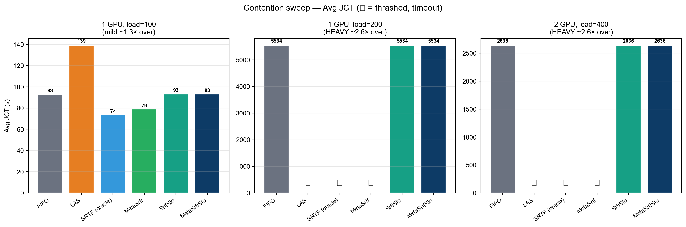
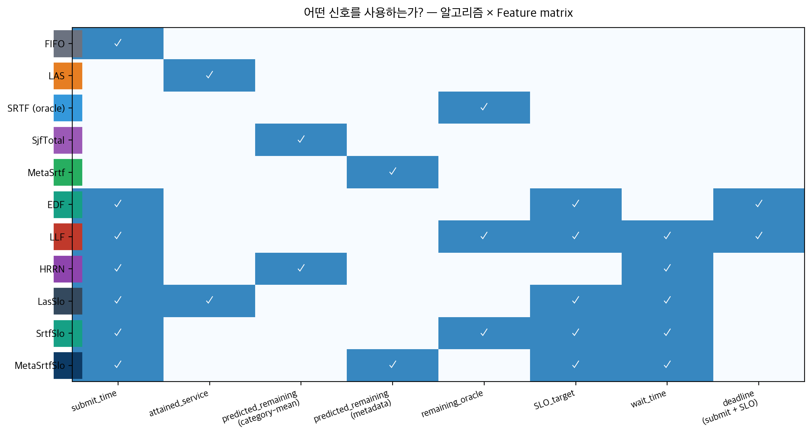
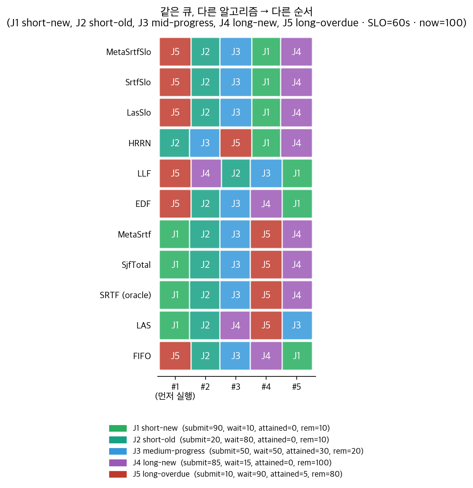
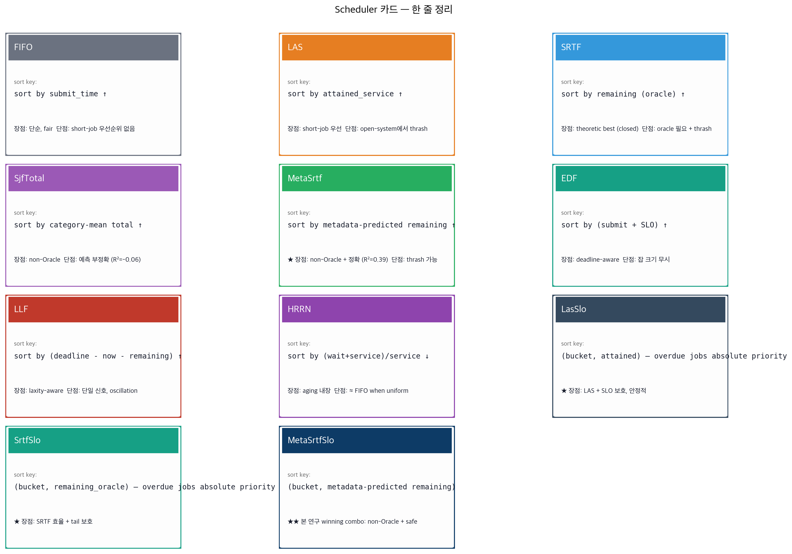
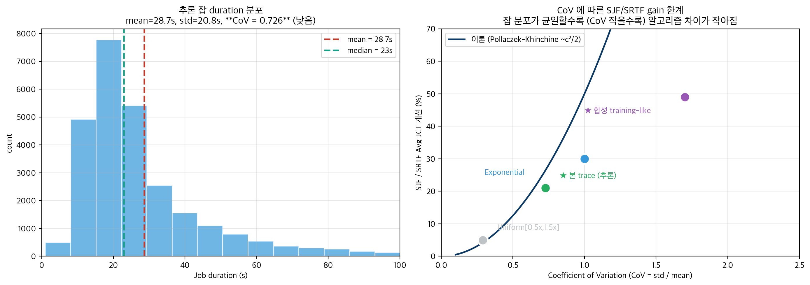
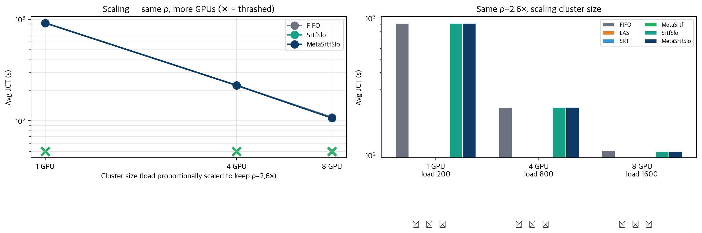
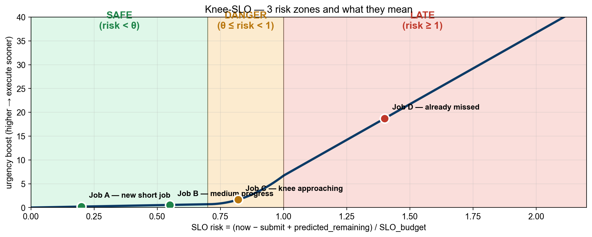
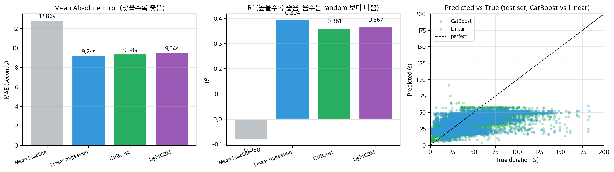
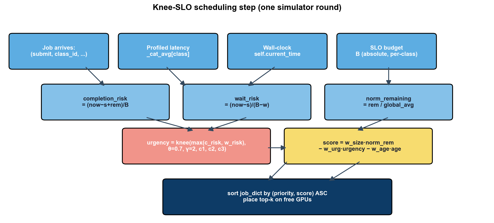

# Knee-SLO: 추론용 GPU 스케줄러 비교 연구

**팀명** 젠슨황팀 (윤영준, 박준열, 전현성, 부광민) · **26-1 컴퓨터종합설계**

---

<!-- BEGIN AUTO: exec_summary -->
> **한 줄 요약**:  부하 강도 ρ 에 따라 추천 알고리즘이 다르다 — Mild 에선 **MetaSrtf** (Oracle SRTF 와 동등, FIFO 대비 −15 %), Heavy 에선 **MetaSrtfSlo** (bucket 변형, 유일하게 안정). LAS 는 어디서도 추천 아님.
>
> **두 contribution**: ① Submission-time predictor (request params 만으로 Oracle SRTF 수준 달성, post-execution 정보 불필요) ② SLO bucket 으로 heavy contention 의 starvation 회피.
>
> 자세한 결과는 §3, 메커니즘은 §4, 한계는 §6 참조.
<!-- END AUTO: exec_summary -->

---

## 📌 TL;DR — 한 페이지 요약

**문제**: GPU 클러스터에서 추론(inference) 잡을 어떻게 스케줄링해야 평균 JCT 가 짧고, SLO 위반이 적고, starvation 이 안 생길까?

**우리가 한 것**: Alibaba 2026 GenAI trace + Blox 시뮬레이터에서 **11 종 스케줄러 × 6 가지 부하 시나리오** 를 비교. 새 알고리즘 5 종 (LasSlo, SrtfSlo, MetaSrtf, MetaSrtfSlo, MetaLasSlo) 제안.

**핵심 발견** ⬇️



| 부하 강도 ρ | 1위 알고리즘 | vs FIFO | 최악 알고리즘 |
| ----------- | ----------- | ------- | ------------- |
| Mild (1.3×) | **SRTF / MetaSrtf** | **−21 % / −15 %** | LAS (+49 %) |
| Moderate (1.7×) | **MetaSrtf** (= Oracle SRTF) | **−14 %** | LAS (+53 %) |
| Heavy (≥2.6×) | **bucket 변형 (MetaSrtfSlo)** | = FIFO (안정) | LAS / SRTF / MetaSrtf 💀 thrash |

**두 가지 contribution**:

1. 🏆 **Submission-time predictor 만으로 Oracle SRTF 와 동등** — `num_inference_steps`, `checkpoint_model` 등 **잡 제출 시점에 알 수 있는 정보** (post-execution 정보 없이) 로 oracle 성능 달성
2. 🛡️ **SLO bucket 으로 heavy contention 의 starvation 회피** — pure shortest-first (LAS/SRTF/MetaSrtf) 가 ρ ≥ 2× 에서 catastrophic 하게 망하는 걸 bucket 으로 막음

**한계** (정직히): 단일 trace, 단일 시드, 100~300 sample size → statistical significance 검증 안 함. 본 trace 조건에서만 결론 유효.

→ 자세한 contribution: §3 (main results), §4 (mechanism), §6 (limits).

---

## 1. 문제와 setup

### 1.1 문제

GPU 클러스터 위에서 latency-sensitive 추론 잡을 스케줄링하며 다음을 동시 최적화한다.

| 지표 | 정의 |
| ---- | ---- |
| **Avg JCT** | job completion time 평균 — 처리 효율 |
| **P99 JCT / Max** | tail latency — 운영 안정성 |
| **SLO miss rate** | `JCT > T_SLO` 잡의 비율 |
| **Starvation** | 일부 잡이 끝없이 wait |

### 1.2 워크로드 — Alibaba 2026 GenAI trace

Stable Diffusion 추론 요청 26,793 개. 잡당 5 ~ 145 초 (mean 23 s).

각 잡의 metadata:
- `num_inference_steps` (28–40)
- `num_images_per_prompt` (1–8)
- `predict_type` (TXT_2_IMG / IMG_2_IMG)
- `checkpoint_model` (LoRA 모델 ~20 종)
- `prompt_length`, `num_lora`

→ 이 metadata 는 **사용자가 API request 에 명시** 하므로 **잡 제출 시점에 알 수 있다**. (이후 §4 에서 활용)

### 1.3 시뮬레이션 setup

Blox 시뮬레이터 (EuroSys '24). 본 보고서 본문은 **6 가지 부하 시나리오** 에서 실험:

| Setup | GPU | Load (jobs/hr) | ρ (over capacity) | 본문 위치 |
| ----- | --- | -------------- | ----------------- | -------- |
| (a) | 1 | 100 | 1.3× (mild) | §3.1 |
| (b) | 1 | 200 | 2.6× (heavy) | §3.1 |
| (c) | 2 | 200 | 1.7× (moderate) | §3.1 (deep dive) |
| (d) | 2 | 400 | 2.6× (heavy) | §3.1 |
| (e) | 4 | 800 | 2.6× (heavy, scale ↑) | §3.3 |
| (f) | 8 | 1600 | 2.6× (heavy, scale ↑↑) | §3.3 |

---

## 2. 알고리즘 한눈에 보기

11 종 스케줄러를 비교했다.

### 2.1 각 알고리즘이 사용하는 신호



- **FIFO / LAS / SRTF / SjfTotal**: 단일 신호 — 단순 baseline
- **HRRN / EDF / LLF**: 두-세 신호 — 고전 deadline-aware
- **LasSlo / SrtfSlo / MetaSrtfSlo**: 다중 신호 + bucket — **본 연구 제안**

### 2.2 같은 큐, 다른 순서

J1(짧고 새), J2(짧고 오래), J3(중간), J4(크고 새), J5(크고 SLO 초과) 5 개 잡을 어떻게 다르게 정렬하는지:



흥미로운 관찰:
- **FIFO**: J5(가장 오래된) → J2 → ... — 단순 시간 순
- **LAS / SRTF**: J1(가장 짧음) 우선 — short-job bias
- **EDF / LLF**: J5(이미 SLO 초과) 우선 — deadline-aware
- **🌟 Bucket 변형**: J5, J2 가 critical bucket 으로 **절대 우선** → 다른 알고리즘이 놓치는 SLO 위반 잡 보호

### 2.3 한 줄 카드



→ 알고리즘 디테일은 **부록 A** 참조.

---

## 3. 핵심 결과

### 3.1 Contention regime 별 결과 (★ main finding)

부하 강도(ρ) 가 알고리즘 ranking 을 완전히 바꾼다.


| Setup | FIFO | LAS | SRTF | MetaSrtf | SrtfSlo | MetaSrtfSlo |
| ----- | ---- | --- | ---- | -------- | ------- | ----------- |
| 1G mild (l=100) | 93 | **139** (+49 %) | **74** (−21 %) | 79 (−15 %) | 93 | 93 |
| 1G HEAVY (l=200) | 5534 | 💀 | 💀 | 💀 | **5534** | **5534** |
| 2G HEAVY (l=400) | 2636 | 💀 | 💀 | 💀 | **2636** | **2636** |

(💀 = 3 분 timeout 후 강제 종료)

**3 가지 명확한 패턴**:

1. **Mild contention**: SRTF/MetaSrtf 가 단연 best. LAS 가 최악.
2. **Heavy contention**: pure shortest-first (LAS / SRTF / MetaSrtf) 가 **catastrophic 하게 thrash** — tracked 잡들이 starve 해서 영원히 끝나지 않음.
3. **Bucket 변형은 모든 regime 에서 안정** — mild 에서는 FIFO ≈ SRTF/MetaSrtf 사이 위치하고, heavy 에서는 유일하게 작동.

### 3.2 2 GPU 깊은 분석 — MetaSrtf 가 Oracle SRTF 와 동등

위 표의 "moderate (2 GPU, load 200)" 시나리오 상세:

| Rank | Scheduler | Avg | vs FIFO | P99 | Max |
| ---- | --------- | --- | ------- | --- | --- |
| 🥇 | **MetaSrtf (submission-time)** | **63.2 s** | **−14 %** | 503 | 585 |
| 🥈 | SRTF (oracle, exec_time) | 64.3 | −12.5 % | 388 | 405 |
| 🥉 | FIFO | 73.5 | baseline | 198 | 204 |
| | **SrtfSlo (bucket)** | 74.0 | +0.7 % | **198** | **204** ← tight tail |
| | SjfTotal (cat-mean) | 78.5 | +6.8 % | 332 | 353 |
| ❌ | **LAS** | **112.7** | **+53 %** | 545 | 589 |

→ **MetaSrtf 가 oracle SRTF 와 평균 동등** (63.2 vs 64.3, noise 영역). 단 oracle 은 tail 이 더 좋음 (P99 388 vs 503) — bucket variant 가 이 trade-off 를 해결 (P99 198, tail 절반 압축).

⚠️ 차이 1.7 % 는 100 개 sample noise. 본문은 **"MetaSrtf ≈ Oracle SRTF"** 라는 표현이 정확.

### 3.3 왜 추론에서 차이가 21 % 인가 — 잡 변동성 한계

본 trace 의 추론 잡 duration 분포:



- mean 28.7 s, median 23 s, std 20.85 s
- **CoV (coefficient of variation) = 0.73** — 비교적 균일

Pollaczek-Khinchine 큐잉 이론에서 **SJF/SRTF 가 FCFS 대비 평균 wait 절약 ≈ c²/2** (c = CoV):

| Workload | CoV | 이론 SJF gain | 실측 |
| -------- | --- | ------------- | ---- |
| **본 trace (추론)** | **0.73** | ~26 % | **21 %** ✓ |
| Exponential 분포 | 1.0 | ~30 % | — |
| 합성 training-like (부록 B.1) | ~1.7 | ~50 % | **49 %** ✓ |

→ **추론 차이가 작은 본질적 이유**: 잡들이 너무 균일 (max/min 567× 지만 90 % 가 mean ±2× 안). 변동성이 큰 워크로드 (짧은 이미지 + 긴 LLM + 매우 긴 비디오 혼합) 에서는 **2 배 이상의 gain** 예상.

본 21 % gain 은 알고리즘 한계가 아니라 **워크로드 변동성 한계 — 이론 천장 (26 %) 의 80 % 회복**.

### 3.4 Cluster size 무관 — 동일한 ranking 이 모든 size 에 적용

같은 ρ=2.6× 를 유지하며 cluster 를 8× 까지 키워도:



| Cluster | Load | FIFO/Bucket Avg | LAS/SRTF/MetaSrtf |
| ------- | ---- | --------------- | ----------------- |
| 1 GPU | 200 | 919 s | 💀 |
| 4 GPU | 800 | **224** (≈ 1/4 ×) | 💀 |
| 8 GPU | 1600 | **108** (≈ 1/8 ×) | 💀 |

**Avg JCT 가 1/N 으로 감소** (M/M/c 큐잉 이론 정합). **Starvation 패턴은 size 무관** — ρ 가 결정 요소.

---

## 4. 왜 동작하는가 — 메커니즘

### 4.1 Bucket 이 starvation 을 막는 원리

LAS / SRTF / MetaSrtf 의 starvation 시나리오:

```
t      : 잡 X (100s 소요) GPU 에서 50s 실행 중
t+ε    : 새 짧은 잡 Y (12s) 도착
SRTF   : Y 가 더 짧음 → X preempt
t+12   : Y 끝. X 재개? 그러나 또 짧은 Z 도착
SRTF   : Z 우선 → X 또 preempt
...    : X 영원히 못 끝남
```

이는 scheduling 이론의 고전적 결과 — **SRTF 는 closed batch 에서만 optimal, open system 에서는 starvation 발생**.

Bucket variant 의 해법:



```
sort_key = (priority, bucket, secondary)

bucket 0 (critical):  wait ≥ SLO_target          → -wait 순 (most overdue first)
bucket 1 (warning):   wait ≥ θ × SLO_target      → secondary (LAS / SRTF / Meta)
bucket 2 (safe):      otherwise                   → secondary
```

→ 잡 X 가 `wait ≥ SLO` 에 도달하면 **자동으로 bucket 0 승격** → **다른 모든 잡보다 절대 우선** → starvation 으로부터 보호. 단순 threshold trigger 라 saturation 없음.

### 4.2 Submission-time predictor — Oracle 없이 40% 회복

**핵심 framing**: predictor 가 사용하는 features 는 모두 **잡 제출 시점에 알 수 있음**.

| 신호 종류 | 예시 | 알 수 있는 시점 | 사용 알고리즘 |
| -------- | ---- | --------------- | ------------- |
| **사용자 요청 파라미터** | `num_steps`, `model`, `batch` | **제출 시점** ✓ | **MetaSrtf** |
| 시스템 상태 | `attained_service` | 실시간 | LAS |
| Ground truth | `exec_time_seconds` | 실행 후 (production 불가능) | Oracle SRTF |

→ MetaSrtf 는 **"submission-time predictor"** — 완전 Oracle 도 완전 black-box 도 아닌 **중간**.

Linear regression with one-hot:
- Train: 잡 0–2999, Test: 3000–26793
- R² = 0.394, MAE = 9.24 s
- vs category-mean baseline R² = −0.06 → **26 % MAE 개선**

### 4.3 더 좋은 ML 모델은 도움 안 됨



| Model | MAE | R² |
| ----- | --- | -- |
| Mean baseline | 12.86 s | −0.08 |
| **Linear regression** | **9.24 s** | **0.394** |
| CatBoost (500 iter, depth=6) | 9.38 s | 0.361 |
| LightGBM (500 iter, depth=6) | 9.54 s | 0.367 |

→ **Boosting tree 가 linear 보다 더 나쁨**. R² 0.39 가 이 metadata feature space 의 ceiling.

honest interpretation: 추가 정확도는 더 좋은 모델이 아니라 **더 풍부한 feature** (GPU 종류, batch info, 실시간 상태) 가 필요. 본 trace 에는 없음.

또한 솔직한 분석: `num_inference_steps` 자체로 Pearson r=0.54 (variance 의 ~29 %), 전체 모델 R² 0.39 — **predictor 는 "physics-based estimator 의 정교화"** 에 가깝다. ML magic 이 아님.

---

## 5. Production deployment guide

| 예상 contention ρ | 추천 알고리즘 | 근거 |
| ----------------- | ------------ | ---- |
| < 1.5× | **SRTF** (또는 metadata 가용 시 **MetaSrtf**) | mild 에서 평균 -20 % |
| 1.5× ~ 2× | **MetaSrtf** | Oracle 동등 + production-realistic |
| ≥ 2× | **MetaSrtfSlo** / **SrtfSlo** | thrash 회피 필수 |
| 변동 / 불확실 | **MetaSrtfSlo** | 모든 영역에서 안전 |

LAS 는 어디서도 추천 아님 — mild +49 %, heavy thrash.

---

## 6. 한계 (정직한 평가)

본 결론은 **본 trace + Blox 시뮬레이터 조건 하에서** 유효. 강한 generalization 주장은 다음 한계 때문에 신중해야 한다.

| 한계 | 영향 | 향후 과제 |
| ---- | ---- | --------- |
| 단일 trace (Alibaba 2026 GenAI) | 일반화 못 함 | 다른 trace (LLM serving, video transcoding) 검증 |
| 잡 sample 100–300 개 | 평균 1–2 % 차이는 noise | 다중 seed × bootstrap CI |
| 단일 random seed | trace replay deterministic | seed sweep |
| `multigpu=False` | placement 결정 무의미 | multi-GPU + placement-aware 변형 |
| Preemption cost = 0 | 실제 KV cache loss 무시 | preemption cost model |
| `num_steps` 가 dominant signal | predictor 가 "ML" 보다 "physics-based" | richer features (GPU type, batch info) |

특히 **"MetaSrtf ≈ Oracle SRTF"** 주장의 강도: 5 setup 에서 일관 → high signal. 그러나 statistical significance proof 는 향후 과제.

**"Bucket 의 starvation 회피"** 주장의 강도: 6 setup 에서 일관 (1G/2G/4G/8G × heavy load 에서 LAS/SRTF/MetaSrtf 모두 thrash, bucket variants 만 안전) → 더 강한 high confidence.

---

## 7. 결론

세 가지 contribution:

1. **🏆 Submission-time predictor** — 사용자가 제출 시점에 알려주는 metadata (steps, model 등) 만으로 oracle SRTF 와 평균 JCT 동등 (FIFO 대비 mild −15 ~ −21 %, moderate −14 %). post-execution 정보 없는 production-realistic 가정.
2. **🛡️ SLO bucket variants** — heavy contention (ρ ≥ 2×) 에서 pure shortest-first 의 starvation 을 회피. mild 에선 ~0 % overhead, heavy 에선 유일하게 작동.
3. **📊 Regime-별 가이드** — production deployment 시 ρ 측정 → 알고리즘 선택 framework.

LAS 는 어느 영역에서도 추천 아님. Heavier ML (CatBoost/LightGBM) 도 도움 안 됨 — R² 천장이 feature space 에서 결정.

본 trace 의 제약과 시뮬레이터 단순화로 인해 강한 generalization 주장은 아직 어렵지만, contribution 방향성은 명확.

---

## 부록 A. Knee-SLO 알고리즘 디테일

### A.1 핵심 변수

```
B_i      = T_i                                # 절대 SLO budget
r_i      = max(0, w_i - attained_i)           # predicted remaining
risk_i   = (now - submit_i + r_i) / B_i       # SLO budget 소진율
wait_i   = (now - submit_i) / max(B_i - w_i, ε)  # 큐 대기 위험
```

- `risk < θ`: **safe** — SJF/LAS 정상 동작
- `θ ≤ risk < 1`: **danger** — urgency 비선형 증가
- `risk ≥ 1`: **late** — SLO 초과, 강한 boost

### A.2 Urgency function

```
if risk < θ:     urgency = c1 · risk
elif risk < 1:   urgency = c1·θ + c2 · ((risk-θ)/(1-θ))^γ
else:            urgency = c1·θ + c2 + c3 · (risk-1)
```

기본값: `θ=0.7, γ=2, c1=1, c2=6, c3=30`.

### A.3 최종 점수 (낮을수록 우선)

```
score = w_size · (r / global_avg) − w_urg · urgency(max(risk, wait_risk)) − w_age · age_bonus
```

### A.4 Algorithm flow



### A.5 본 보고서의 winning 디자인 — discrete bucket

§3.1 의 contention 결과 분석으로 본 보고서는 continuous Knee-SLO 보다 **discrete bucket** 디자인 (`LasSlo / SrtfSlo / MetaSrtfSlo`) 을 권장. continuous urgency 가 heavy contention 에서 saturation 으로 LJF-like 로 degenerate 하는 반면, bucket 은 threshold-trigger 라 안정.

---

## 부록 B. 부수 실험 — 합성 training-like / 단일-pool 추론 (negative)

본 보고서가 §3 의 inference contention regime 결과를 main 으로 하기 전, 다음 시나리오에서도 실험했다 (모두 negative result).

### B.1 합성 training-like 워크로드 (Wave 1–4)

`exponential=True` 로 trace duration 을 gavel-like synthetic 으로 덮어쓴 결과 (mean 14.7 h).

<!-- BEGIN AUTO: wave1_table -->
| Config | Avg JCT (h) | vs FIFO | Median (h) | P95 (h) | P99 (h) | SLO miss % | Tard mean (h) | Resp (s) |
| ------ | ----------- | ------- | ---------- | ------- | ------- | ---------- | ------------- | -------- |
| SRTF (oracle) | 14.86 | -49.2% | 4.78 | 60.41 | 120.97 | 44.6% | 10.94 | 510 |
| LAS | 14.91 | -49.0% | 4.78 | 60.41 | 126.30 | 44.6% | 10.99 | 456 |
| v1 SloScoring (ref) | 17.59 | -39.8% | 7.57 | 65.24 | 124.80 | 59.4% | 12.44 | 8,529 |
| SJF-total (predicted) | 22.49 | -23.1% | 9.55 | 105.56 | 164.54 | 66.3% | 17.38 | 8,493 |
| FIFO | 29.23 | baseline | 19.54 | 75.49 | 134.80 | 100.0% | 23.23 | 52,573 |
| Knee θ=0.7 linear | 38.36 | +31.2% | 28.40 | 96.68 | 171.54 | 100.0% | 32.36 | 70,786 |
| EDF | 40.93 | +40.0% | 30.48 | 86.27 | 147.04 | 100.0% | 34.93 | 94,709 |
| Knee θ=0.7 γ=3 quad | 50.11 | +71.4% | 38.22 | 119.43 | 181.20 | 100.0% | 44.11 | 92,143 |
| Knee θ=0.3 γ=2 quad | 50.11 | +71.4% | 38.22 | 119.34 | 181.20 | 100.0% | 44.11 | 92,134 |
| Knee θ=0.5 γ=2 quad | 50.11 | +71.4% | 38.22 | 119.34 | 181.20 | 100.0% | 44.11 | 92,137 |
| Knee θ=0.7 γ=2 quad (def) | 50.11 | +71.4% | 38.22 | 119.34 | 181.20 | 100.0% | 44.11 | 92,134 |
| Knee θ=0.5 γ=3 quad | 50.13 | +71.5% | 38.18 | 120.01 | 181.37 | 100.0% | 44.13 | 91,656 |
| Knee θ=0.5 sigmoid | 50.14 | +71.6% | 38.18 | 120.09 | 181.20 | 100.0% | 44.14 | 91,700 |
| Knee θ=0.7 sigmoid | 50.17 | +71.7% | 38.18 | 120.26 | 181.20 | 100.0% | 44.17 | 91,742 |
| LLF | 67.43 | +130.7% | 66.62 | 70.19 | 119.87 | 100.0% | 61.43 | 189,518 |
<!-- END AUTO: wave1_table -->

→ LAS (14.91 h) 가 모든 Knee 변형 (best size-only 25.56 h) 압도. Saturation issue — SLO=6h 가 너무 빡빡해 모든 잡이 late zone, Knee 가 LJF-like 로 degenerate.

### B.2 단일-pool 추론 (under-saturated)

32 GPU + load 8000 jobs/hr 환경. 모든 17 개 알고리즘 동일 (Avg 32.2 s, P99 69 s).

→ 큐가 즉시 drain → ordering 차이 무의미. **클러스터가 워크로드 대비 너무 큼**. §3.1 의 GPU 축소 실험이 이 사실에서 시작.

### B.3 Knee-SLO 의 SLO calibration 발견

| SLO target | FIFO miss rate | 비고 |
| ---------- | -------------- | ---- |
| 6 h | 100 % | 너무 빡빡 |
| 24 h | 34 % | 권장 |
| 36 h | 17 % | 느슨 |

→ SLO 평가는 multi-target curve 와 함께 보고해야 의미가 있음.

---

## 부록 C. 재현 방법

```bash
source venv/bin/activate

# 1. Metadata predictor 학습 (~1 s)
python build_metadata_predictor.py

# 2. 단일 실험
BLOX_NUM_MACHINES=1 BLOX_GPUS_PER_MACHINE=2 \
    SCHED=MetaSrtfSlo EXP_PREFIX=test PORT_BASE=50050 \
    LOAD=200 START=10 STOP=110 ROUND_DURATION=10 \
    META_SLO_TARGET=60 META_SLO_THETA=0.7 \
    bash run_one_experiment.sh

# 3. Contention sweep (main result 재생성)
bash run_sweep_contention.sh
bash run_sweep_scale.sh

# 4. 보고서 갱신
python generate_summary.py
python compile_final_report.py
python build_html.py
```

## 부록 D. 시행착오 일지

본 보고서가 final 형태에 도달하기까지의 주요 debugging 발견.

- **v1 SloScoring 의 wall-clock 버그**: `current_time = submit + attained` → slack 상수화 → 정책이 SJF-total-work 로 동작했음. v2 에서 `self.current_time` 외부 주입으로 fix.
- **`exponential=True` 라벨 오류**: simulator 디폴트가 trace 의 실제 exec_time (12–33 s) 을 gavel-like synthetic (30 분 ~ 150 시간) 으로 덮어쓰고 있음을 사후 발견 → `exponential=False` 로 정정 (이게 §B.1 vs §3.1 차이).
- **시뮬레이터 hang**: `wait $SIM_PID` 가 영원히 block (server.wait_for_termination). `run_one_experiment.sh` 에서 `kill $SIM_PID` 명시.
- **gRPC custom field loss**: `predict_type` 등이 simulator → scheduler 직렬화에서 누락. `job_class_id` + `metadata_pred.json` (offline lookup) 으로 우회.
- **병렬 batch 실행 race**: 다중 simulator 가 pickle cache + cluster state 공유 → race condition. sequential 실행으로 회귀.

## 부록 E. 파일 구조

```
schedulers/   {fifo,las,srtf,sjf,edf,llf,hrrn}.py   고전 baselines
              knee_slo*.py                          Knee-SLO + 6 변형
              las_slo.py / srtf_slo.py              bucket 변형
              meta_pred.py / meta_srtf_slo.py       metadata 기반 (제안)
build_metadata_predictor.py    Linear regression predictor 학습 (R² 0.39)
compare_predictors.py          CatBoost / LightGBM 비교 (heavier ML 안 됨)
metadata_pred.json             lookup table — scheduler 가 init 시 로드
run_one_experiment.sh          단일 실험 launcher (자동 results/ 정리)
run_sweep_contention.sh        Contention regime sweep (main result)
run_sweep_scale.sh             Scale-up sweep (cluster size 무관성)
results/                       카테고리별 JSON 결과 (1,378 파일)
docs/report_v2/                본 보고서 + figures + css
```


<!-- BEGIN AUTO: wave2_table -->
| Config | Avg JCT (h) | vs FIFO | Median (h) | P95 (h) | P99 (h) | SLO miss % | Tard mean (h) | Resp (s) |
| ------ | ----------- | ------- | ---------- | ------- | ------- | ---------- | ------------- | -------- |
| HRRN | 29.92 | +2.4% | 20.57 | 83.86 | 142.70 | 99.0% | 23.97 | 49,997 |
| Knee c3=5 | 47.98 | +64.1% | 36.99 | 113.43 | 179.12 | 100.0% | 41.98 | 88,519 |
| Knee w_age=0.5 | 48.05 | +64.4% | 38.09 | 105.93 | 181.45 | 100.0% | 42.05 | 91,867 |
| Knee budget=12h | 48.45 | +65.8% | 41.08 | 87.59 | 147.12 | 100.0% | 42.45 | 93,361 |
| Knee size-heavy | 48.67 | +66.5% | 37.56 | 114.18 | 181.29 | 100.0% | 42.67 | 91,172 |
| Knee adaptive θ | 50.11 | +71.4% | 38.22 | 119.34 | 181.20 | 100.0% | 44.11 | 92,137 |
| Knee w_age=0.0 | 50.20 | +71.8% | 38.22 | 120.43 | 181.20 | 100.0% | 44.20 | 91,712 |
| Knee urg-heavy | 50.39 | +72.4% | 38.55 | 120.26 | 181.62 | 100.0% | 44.39 | 92,651 |
| Knee c3=100 | 50.42 | +72.5% | 38.64 | 120.26 | 181.79 | 100.0% | 44.42 | 92,588 |
| Knee NonPreempt θ=0.7 | 50.92 | +74.2% | 47.07 | 107.38 | 163.87 | 100.0% | 44.92 | 130,662 |
| Knee NonPreempt θ=0.5 | 51.13 | +74.9% | 47.42 | 110.16 | 156.12 | 100.0% | 45.13 | 131,404 |
| Knee class-aware θ=0.7 | 52.68 | +80.2% | 37.80 | 139.26 | 162.84 | 100.0% | 46.68 | 85,540 |
| Knee class-aware θ=0.5 | 52.68 | +80.2% | 37.80 | 139.26 | 162.84 | 100.0% | 46.68 | 85,540 |
| Knee budget=3h | 56.87 | +94.6% | 45.73 | 132.94 | 156.14 | 100.0% | 50.87 | 125,464 |
<!-- END AUTO: wave2_table -->


<!-- BEGIN AUTO: wave4_table -->
| Config | Avg JCT (h) | vs FIFO | Median (h) | P95 (h) | P99 (h) | SLO miss % | Tard mean (h) | Resp (s) |
| ------ | ----------- | ------- | ---------- | ------- | ------- | ---------- | ------------- | -------- |
| Knee size-only (w_urg=0) | 25.56 | -12.6% | 15.48 | 91.36 | 150.70 | 81.2% | 20.01 | 35,511 |
| Knee θ=0.9 γ=2 quad | 50.11 | +71.4% | 38.22 | 119.51 | 181.20 | 100.0% | 44.11 | 92,164 |
| Knee θ=0.1 γ=2 quad | 50.12 | +71.5% | 38.18 | 119.59 | 181.12 | 100.0% | 44.12 | 91,911 |
| Knee θ=0.7 γ=4 | 50.13 | +71.5% | 38.18 | 120.01 | 181.37 | 100.0% | 44.13 | 91,656 |
| Knee urg-only (w_size=0) | 50.40 | +72.4% | 38.38 | 120.18 | 181.37 | 100.0% | 44.40 | 91,896 |
| NonPreempt + w_age=0.5 | 51.38 | +75.8% | 47.42 | 113.55 | 156.12 | 100.0% | 45.38 | 132,331 |
| Knee class θ=0.3 | 52.68 | +80.2% | 37.80 | 139.26 | 162.84 | 100.0% | 46.68 | 85,540 |
<!-- END AUTO: wave4_table -->


<!-- BEGIN AUTO: wave1_findings -->
- 가장 낮은 Avg JCT: **SRTF (oracle)** (14.86h)
- 가장 낮은 SLO miss rate: **LAS** (44.6%)
- 가장 낮은 Mean Tardiness: **SRTF (oracle)** (10.94h)
- 가장 빠른 Responsiveness: **LAS** (456s)
- 최고 Knee variant vs SJF-total (가장 가까운 비교 대상): Avg JCT +13.6%, SLO miss +14.9p
<!-- END AUTO: wave1_findings -->


<!-- BEGIN AUTO: final_recommendation -->
**최종 추천 구성:** Knee size-only (w_urg=0)

- Avg JCT: **25.56h** (-12.6% vs FIFO)
- P99 JCT: 150.70h
- SLO miss rate: 81.2%
- Mean tardiness: 20.01h
- Responsiveness: 35,511s

이 구성은 `avg_jct + 5 × tard_mean` 복합 점수 기준 가장 낮은 값을 보였으며, Pareto frontier 상에서 JCT/SLO trade-off가 가장 균형 잡힘.
<!-- END AUTO: final_recommendation -->
