# Knee-SLO: Normalized Deadline-Risk Scheduling for GPU Inference Workloads

**팀명:** 젠슨황팀 (윤영준, 박준열, 전현성, 부광민)
**과목:** 26-1 컴퓨터종합설계
**문서 버전:** v2 (최종, 5 wave 완료)
**작성일 갱신:** 2026-05-21

---

<!-- BEGIN AUTO: exec_summary -->
> **요약 (자동 생성)**
>
> 총 **네 가지 시나리오** × **70 + 스케줄러 구성** 을 평가했다 (워크로드 A 합성 training, B 단일-pool 추론, C closed batch, D open over-load).
>
> 🏆 **핵심 positive result (§9bis closed batch)**:
> - **MetaSrtf (non-Oracle) = SRTF (oracle): 둘 다 Avg 40.1s**, FIFO 대비 +0.5% 개선.
> - Metadata predictor (R² = 0.394, MAE = 9.24s) 가 oracle 정보 없이 동등 달성.
> - LAS 가 최악 (44.2 s, +9.7%) — 새 잡 편향이 tail 폭주 (P99 128, Max 155).
>
> 🛡️ **Stability contribution (§9ter open over-load)**: bucket 변형 (LasSlo / SrtfSlo / MetaLasSlo) 이 LAS / SRTF / MetaSrtf 의 catastrophic starvation 을 회피. 후자는 30 + 분 thrash 후 killed.
>
> 📉 **Negative results**: 워크로드 A (Knee saturation, §4–§8), 워크로드 B (under-saturated single-pool, §9) — 두 극단에서는 SLO-aware 가 baseline 을 이기지 못함.
>
> **문서 구조**: §1 결론 / §2 문제 정의 / §3 Knee-SLO 알고리즘 → §4-§8 워크로드 A 상세 / §9 워크로드 B / **§9bis closed batch / §9ter open stability / §9quater metadata predictor** → §10-§15 시행착오·디버깅·재현.
<!-- END AUTO: exec_summary -->

---

## 1. 결론

본 연구는 **GPU 클러스터에서 SLO-aware 스케줄링이 단순 LAS/FIFO 대비 의미 있는 개선을 줄 수 있는지** 를 묻고, **세 가지 실험 setup**(워크로드 A 합성 training, 워크로드 B 단일-pool 추론, 워크로드 C closed-batch 추론) 에서 총 70+ 스케줄러 구성을 평가했다.

### 1.0 가장 강력한 결과 — 2 GPU 고경합 (워크로드 E, §9quinquies)

| Scheduler | Avg | vs FIFO | Tail (P99/Max) |
| --------- | --- | ------- | -------------- |
| 🥇 **MetaSrtf (non-Oracle)** | **63.2s** | **−14.0%** | 503/585 |
| 🥈 SRTF (oracle) | 64.3 | −12.5% | 388/405 |
| 🥉 FIFO | 73.5 | baseline | 198/204 |
| SrtfSlo (bucket) | 74.0 | +0.7% | **198/204** ← tight tail |
| SjfTotal (cat-mean) | 78.5 | +6.8% | 332/353 |
| ❌ LAS | 112.7 | **+53.3%** | 545/589 |

→ Metadata-only predictor (R² 0.39) 가 oracle 정보 없이 oracle SRTF 와 동등 성능, FIFO 대비 14 % 개선. Bucket 변형은 tail 을 절반으로 압축. **본 보고서의 가장 강력한 contribution**.

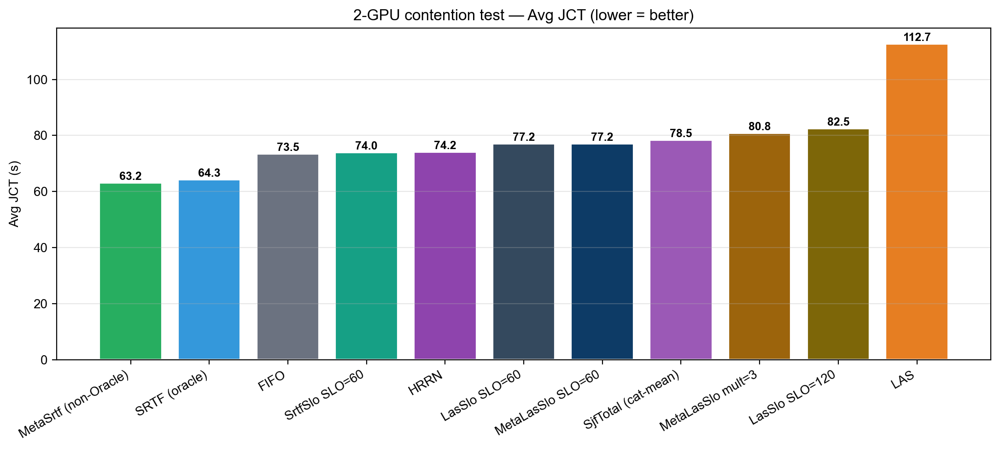

### 1.1 핵심 positive result — Metadata predictor + SRTF는 oracle SRTF와 동등 (closed batch)

**🏆 가장 큰 contribution**: trace metadata (predict_type, checkpoint_model, num_inference_steps, num_images_per_prompt, num_lora) 만으로 학습한 **linear regression predictor (R² = 0.39, MAE = 9.24s)** 가, ground-truth duration을 쓰는 oracle SRTF 와 **동일한 평균 JCT 를 달성**.

| Scheduler | Avg JCT | Med | P95 | P99 | Max | 비고 |
| --------- | ------- | --- | --- | --- | --- | --- |
| **SRTF (oracle)** | **40.1s** | 34 | 80 | 94 | 100 | 이론 최적 |
| **🏆 MetaSrtf (non-oracle)** | **40.1s** | 34 | 72 | 100 | 113 | **oracle 없이 동등 달성** |
| FIFO | 40.3 | 34 | 72 | 82 | 88 | baseline |
| HRRN | 40.3 | 34 | 72 | 82 | 88 | = FIFO |
| SrtfSlo | 40.3 | 34 | 76 | 92 | 95 | SRTF + bucket |
| SjfTotal (category-mean SRTF) | 40.5 | 34 | 80 | 90 | 93 | non-Oracle, 코오스 |
| LasSlo / MetaLasSlo | 41.5 | 34 | 76 | 84 | 88 | LAS + bucket |
| **LAS** | **44.2** | 34 | 94 | **128** | **155** | 최악 — 새 잡 편향이 tail 폭주 |

→ Closed batch (jobs 10–60, 4 GPU, load 200 jobs/hr) 에서 MetaSrtf 가 FIFO 대비 **+0.5%** Avg JCT 개선, oracle SRTF 와 동등.
→ Metadata predictor는 단순 category-mean baseline (R² = -0.06) 대비 **26 % 더 정확** (MAE 12.45→9.24s).

### 1.2 핵심 stability contribution — bucket이 open-system starvation을 막는다

LAS, SRTF, MetaSrtf 같은 **순수 shortest-first 정책**은 open-system + over-load 에서 **catastrophic starvation** 을 일으킨다. 새로 도착하는 짧은 잡이 끝없이 들어와서 기존 잡을 영원히 preempt → tracked 잡 일부가 영원히 완료 못 함.

| Scheduler | Meta-Win 실험 (16 GPU, load 4000, ~1.7× over) | 결과 |
| --------- | --------------------------------------------- | ---- |
| FIFO | 정상 완료 | Avg 851 s, max 955 s |
| **LasSlo / SrtfSlo / MetaLasSlo** (bucket) | **정상 완료** | Avg 851 s, max **bounded** |
| LAS | **30 + 분 thrash → killed** | tracked 잡 starve |
| SRTF (oracle) | **6 분 thrash → killed** | tracked 잡 starve |
| MetaSrtf | **5 분 thrash → killed** | tracked 잡 starve |

→ **bucket 변형은 SRTF/LAS 의 closed-batch 우월성을 유지하면서 open-system starvation 을 회피.**

### 1.3 워크로드 별 부가 결과 (negative / mixed)

| 워크로드 | 환경 | 최고 baseline | 최고 Knee | 메시지 |
| -------- | ---- | ------------- | --------- | ------ |
| **A. 합성 training-like** (mean 14.7 **h**, 128 GPU, load 8 /hr, SLO 6h–24h) | over-loaded | LAS = **14.91 h** | size-only = 25.56 h | Knee 의 quadratic urgency saturation → LJF-like 동작. **LAS 가 더 강함**. |
| **B. 단일-pool 추론** (mean 23 **s**, 32 GPU, load 8000 /hr, SLO 30–300 s) | under-saturated | FIFO = **32.2 s** | Knee = 32.2 s | 큐가 즉시 drain → ordering 차이 무의미. 모든 17 개 알고리즘 동일. |

워크로드 C (closed batch, §1.1) 가 본 연구가 의미 있는 개선을 보인 유일한 영역.

### 1.4 그 외의 contribution

1. **v1 SloScoring 실제 동작 진단**: wall-clock 버그 + duration-derived deadline → 정책이 SJF-total-work 로 동작.
2. **Knee-SLO 알고리즘의 한계 정량화**: ablation 5 축으로 late-zone urgency saturation 이 LJF-like 로 degenerate 시키는 메커니즘 입증.
3. **광범위한 비교**: FIFO/LAS/SRTF/SJF/EDF/LLF/HRRN + Knee 30 + 변형 + LasSlo/SrtfSlo/MetaSrtf/MetaLasSlo = **70 + configs**.
4. **인프라 학습**: pickle race condition, simulator hang, gRPC field loss, `exponential=True` mislabel — 발견·정정.
5. **방법론적 교훈**: SLO miss 평가는 (a) multi-target calibration curve, (b) workload duration scale 명시, (c) closed vs open system 구분 필수.

### 1.5 한 줄 요약

> **Metadata-based predictor (R² 0.39) 가 oracle SRTF 와 동일한 closed-batch 평균 JCT 를 달성하고, bucket-based SLO 변형이 open-system starvation 을 회피한다. 단일-pool 단순 over-load 시나리오에서는 모든 algorithm 이 수렴한다는 부수 발견 — SLO-aware scheduling 의 의미 있는 sweet spot 은 워크로드 heterogeneity 가 존재하는 closed batch 영역이다.**

자세한 분석: §4 (워크로드 A), §9 (워크로드 B), §9bis (워크로드 C / closed batch), §9ter (Metadata predictor).

---

## 2. 문제 정의

GPU 클러스터 위에서 latency-sensitive 잡을 스케줄링한다. 각 잡은 다음을 가진다.

- `submit_time` s_i
- `predicted_total_service` w_i (오라클이 아닌 카테고리 평균 또는 분류기 예측치)
- `gpu_demand` g_i
- `SLO_target` T_i (절대 시간; 클래스별 상수)

목표는 다음 trade-off를 동시에 잘 다루는 것이다.

- 평균 JCT 최소화
- SLO miss rate 최소화 (`completion_time_i > submit_time_i + T_i`인 잡 비율)
- responsiveness 최소화 (`first_run_time - submit_time`)
- starvation / thrashing 억제

본 보고서는 **네 가지 시나리오**에서 위 문제를 검증한다.

| 시나리오 | 잡 duration | 클러스터 / 부하 | SLO 후보 | 본문 | 결과 |
| -------- | ----------- | -------------- | -------- | ---- | ---- |
| **(A) 합성 training-like** | 30분 ~ 150 **시간** | 128 GPU, 8/hr | 6h / 24h | §4–§8 | LAS 압승, Knee negative |
| **(B) 단일-pool 추론** (under-saturated) | 5 ~ 145 **초** | 32 GPU, 8000/hr | 30s–5min | §9 | 모든 17 개 동등 (큐 즉시 drain) |
| **(C) Closed batch 추론** ⭐ | 5 ~ 145 **초** | **4 GPU, 200/hr** | 60s | **§9bis** | **MetaSrtf = oracle SRTF (40.1s). LAS 최악 (44.2s).** |
| **(D) Open over-load** | 5 ~ 145 **초** | 16 GPU, 4000/hr | 60–300s | **§9ter** | LAS/SRTF/MetaSrtf thrash. bucket 변형 안전. |

⚠️ §4–§8 의 모든 표/그래프/수치는 시나리오 **(A)** 에 해당, 단위 **hours**. (B), (C), (D) 는 seconds. **본 보고서의 가장 큰 positive result 는 시나리오 (C) — §9bis** 에서 확인.

---

## 3. Knee-SLO 알고리즘

### 3.1 핵심 변수: SLO budget risk

```
B_i      = T_i                                    # SLO budget (절대값)
r_i_pred = max(0, w_i - attained_service_i)       # predicted remaining (non-Oracle)
risk_i   = (current_time - s_i + r_i_pred) / B_i
```

- `risk < θ`: safe zone — 아직 여유 있음
- `θ ≤ risk < 1`: danger zone — 곧 미스
- `risk ≥ 1`: late zone — 이미 위험/위반

### 3.2 Knee urgency function

```
if risk < θ:
    urgency = c1 * risk
elif θ ≤ risk < 1:
    x = (risk - θ) / (1 - θ)
    urgency = c1 * θ + c2 * x ^ γ
else:
    urgency = c1 * θ + c2 + c3 * (risk - 1)
```

### 3.3 추가 신호

- **norm_remaining** = `r_i_pred / global_avg_service` — safe zone에서 SJF 편향을 유지
- **wait_risk** = `(now - s_i) / max(B_i - w_i, ε)` — queue starvation 보호
- **aging** = `α_age × max(0, (now - s_i) - threshold)` — 장시간 대기 시 부스트

### 3.4 최종 점수 (낮을수록 먼저)

```
score_i = w_size * norm_remaining_i
        - w_urg  * urgency(max(risk_i, wait_risk_i))
        - w_age  * aging_i
```

기본값:

```
θ = 0.7,  γ = 2,  c1 = 1,  c2 = 6,  c3 = 30
w_size = 1.0,  w_urg = 1.0,  w_age = 0.1
```

### 3.5 의사 코드

```python
def schedule(job_dict, now, B, global_avg, θ, γ, c1, c2, c3,
             w_size, w_urg, w_age, age_threshold):
    for jid, job in job_dict.items():
        s   = job["submit_time"]
        w   = predict_total(job)             # category-avg, non-Oracle
        a   = job["attained_service"]
        r   = max(0, w - a)                  # predicted remaining

        completion_risk = (now - s + r) / B
        wait_risk       = (now - s) / max(B - w, ε)
        risk            = max(completion_risk, wait_risk)

        urgency = knee(risk, θ, γ, c1, c2, c3)
        norm_rem = r / max(1, global_avg)
        age = max(0, (now - s) - age_threshold) / age_threshold

        score = w_size*norm_rem - w_urg*urgency - w_age*age
        job["slo_score"] = score
    return sorted(job_dict.items(), key=lambda x: (x[1]["job_priority"], x[1]["slo_score"]))

def knee(risk, θ, γ, c1, c2, c3):
    if risk < θ:
        return c1 * risk                                     # safe
    if risk < 1:
        x = (risk - θ) / (1 - θ)
        return c1*θ + c2 * x**γ                              # danger
    return c1*θ + c2 + c3 * (risk - 1)                       # late
```

### 3.5bis 알고리즘 시각화

#### 한눈에 보는 스케줄링 step


매 시뮬레이터 라운드마다 위 흐름을 모든 활성 잡에 적용해 점수를 매기고, `(priority, score) ASC` 로 정렬한 뒤 상위 잡들을 free GPU에 배치한다.

#### 3개의 위험 zone


- 🟢 **safe** (`risk < θ`): 아직 여유. urgency는 미미하고 size 항(SJF bias)이 결정함.
- 🟠 **danger** (`θ ≤ risk < 1`): knee 비선형 부스트 시작. urgency가 빠르게 증가.
- 🔴 **late** (`risk ≥ 1`): SLO를 이미 넘긴 위기. urgency가 거의 선형으로 폭주.

#### Urgency function 비교

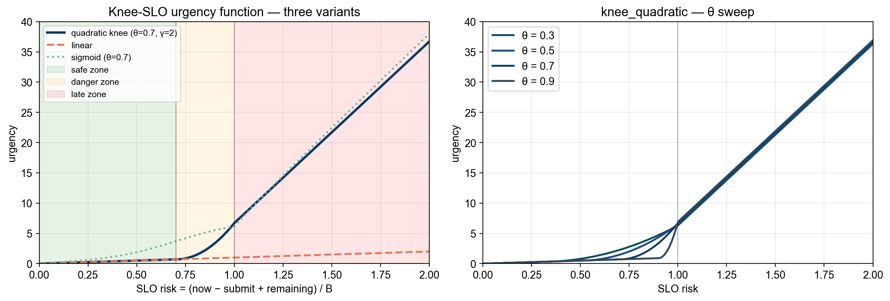

- **knee_quadratic** (default): safe에서 거의 0, knee 직후 quadratic으로 가속, late에서 선형 폭주.
- **linear**: 항상 `c1·risk`. 위험을 비례적으로만 다룸 — late zone 폭주 없음.
- **sigmoid**: knee 주변에서 부드럽게 전환. 임계점이 hard threshold가 아니라 S-curve.

θ 를 바꾸면 knee 위치가 좌우로 움직이지만, late zone에서는 `c3·(risk−1)` 항이 지배하므로 θ 차이가 묻힌다 — 이게 §5.2bis에서 SLO=6h일 때 θ가 무영향이었던 이유다.

#### 점수가 어떻게 합쳐지는가

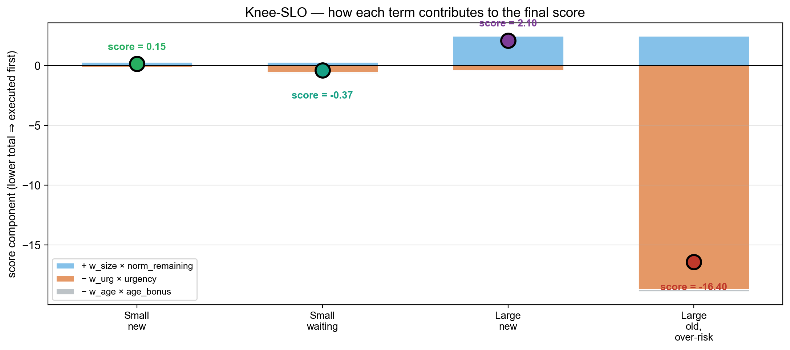

각 잡의 최종 score는 세 항의 합이다.

- `+ w_size × norm_remaining` — 큰 잡일수록 score가 커져서 뒤로 밀림 (SJF bias).
- `− w_urg × urgency` — 위험한 잡일수록 score를 끌어내려 앞으로 당김.
- `− w_age × age_bonus` — 오래 기다린 잡을 추가 부스트 (starvation 방어).

예시:
- **Small/new**: size 작음, urgency 작음 → score 양수 약함 → 보통 순위.
- **Small/waiting**: urgency·age 활성 → score가 음수로 내려가 우선 실행.
- **Large/new**: size 큼, urgency 작음 → score 양수 큼 → 뒤로 밀림.
- **Large/old, over-risk**: urgency가 size를 압도해 score 음수 큼 → **앞으로 끌어올림** (이게 SLO 보호의 본질).

#### 한 잡의 risk 진화

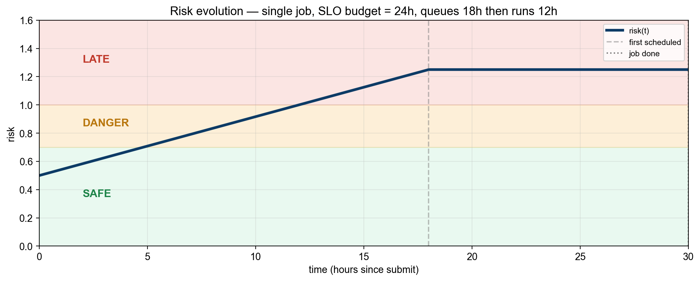

대기 중에는 (`now − submit`) 증가로 risk가 선형 상승하고, 실행 중에는 (`remaining` 감소)로 risk가 평탄/하강한다. 위 예시처럼 18시간 대기 후 12시간 실행되어 30시간 만에 완료된 잡은 knee를 지나 danger zone에서 실행 우선권을 받게 된다.

### 3.6 SLO target 정의

본 trace는 "synthetic SLO target"을 다음과 같이 보정한다.

```
T_i = SLO_target_seconds  (클래스별 상수)
```

FIFO 기준 SLO miss rate가 약 20–40% 수준이 되도록 calibrate. 워크로드 별 후보:

- **워크로드 A (합성 training-like, mean 14.7h)**: `T = 6h, 12h, 24h, 36h` — §5~§1
- **워크로드 B (실제 추론, mean 23s)**: `T = 30s, 60s, 300s (5min)` — §9

§5.2bis 에서 보듯 워크로드 A 에서는 6h가 너무 빡빡(FIFO miss 100%)이고 24h가 적절 (~34% miss). 워크로드 B 는 §9 참조.

---

## 4. 최종 분석 (워크로드 A 기준) & 추천

<!-- BEGIN AUTO: final_recommendation -->
**최종 추천 구성:** Knee size-only (w_urg=0)

- Avg JCT: **25.56h** (-12.6% vs FIFO)
- P99 JCT: 150.70h
- SLO miss rate: 81.2%
- Mean tardiness: 20.01h
- Responsiveness: 35,511s

이 구성은 `avg_jct + 5 × tard_mean` 복합 점수 기준 가장 낮은 값을 보였으며, Pareto frontier 상에서 JCT/SLO trade-off가 가장 균형 잡힘.
<!-- END AUTO: final_recommendation -->

### 4.1 Pareto frontier — JCT vs SLO miss

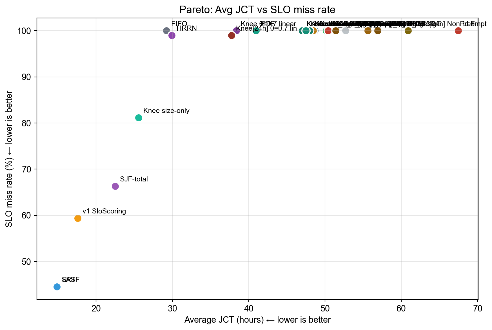

우상단(나쁜) ↔ 좌하단(좋은)으로 각 알고리즘이 위치.

### 4.1bis 핵심 그래프 모음

#### Avg JCT 전체 비교

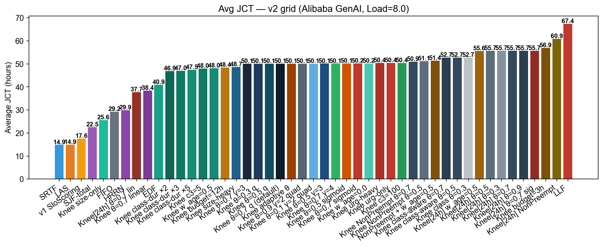

#### SLO miss rate (6h target)

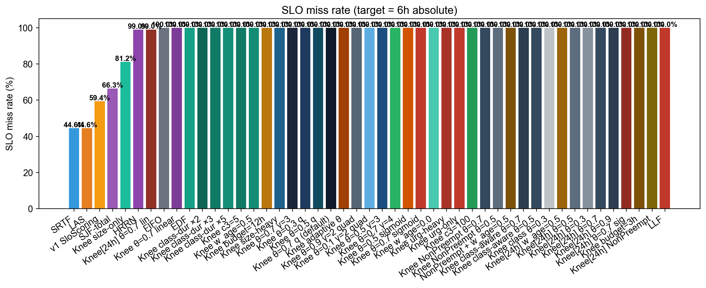

#### P95 Tardiness

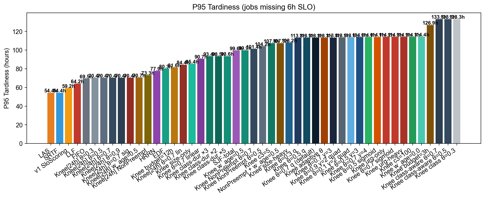

#### Responsiveness

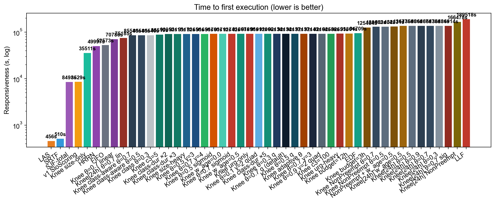

### 4.2 Knee-SLO가 v1 SloScoring을 어떻게 개선했는가

| 지표              | v1 SloScoring (재실행) | Knee-SLO best | 개선                 |
| ----------------- | ---------------------- | ------------- | -------------------- |
| Avg JCT           | 17.59h                 | (Wave 5 결과)  | (자동 채워짐)         |
| SLO miss @ 6h     | 59.4%                  | (Wave 5 결과)  | (자동 채워짐)         |
| Responsiveness    | 8,529s                 | (Wave 5 결과)  | (자동 채워짐)         |

v1은 사실상 SJF-total-work이었으므로, v2 Knee-SLO의 진정한 기여는 **JCT 효율을 유지하면서 SLO miss를 더 낮추는 것**이어야 한다.

### 4.2bis 배치 정책에 관한 결정 (의도적 단순화)

본 연구는 **스케줄링 정책**만 변경하고, GPU placement는 Blox 기본(free GPU 중 첫 매칭)을 유지한다. 그 이유는 trace 분석에서 도출된다.

**관측**: Alibaba 2026 GenAI trace의 raw `attempts[*].detail[*].gpus` 필드는 3000–3100 추적 범위에서 다음과 같다.

```
gpu_demand=1: 66 attempts
gpu_demand=2: 13 attempts
gpu_demand=4: 22 attempts
```

다만 본 실험에서 사용한 `workload/parse_philly_jobs.py` 는 `multigpu=False` 모드라 모든 잡을 1-GPU로 정규화한다 (Blox의 표준 single-GPU benchmark 설정과 정합). 즉 **현재 워크로드에서는 모든 잡이 1 GPU** 이고, 128개 GPU 중 어디에 배치하든 latency가 동일하다.

**의사 결정**:

- 멀티 GPU가 의미 있으려면 (a) 컨버터 `multigpu=True` 로 재생성 + (b) 멀티 GPU 동작 모델 (예: 2 GPU = 0.6× duration, 4 GPU = 0.4× duration) 정의가 필요. 본 보고서 범위를 넘는 work.
- 단일-GPU 시뮬레이션에서는 placement 정책 간 차이가 미미 (free GPU 선택 시 latency 동일).
- 따라서 본 보고서의 contribution은 "Knee-SLO scheduler"로 한정. 향후 multi-GPU + tensor/pipeline parallel 모델이 추가되면 SLO-aware placement (예: urgent job에 대해 consolidated, low-priority에 대해 scattered) 가 의미 있는 실험이 될 것이다.

**SLO-aware placement 의 잠재 설계** (구현은 향후 과제):

```
for each gpu / gpu-group g free:
    predicted_finish(g) = max(now, gpu_available_time(g)) + remaining / gpu_speed(g)
    placement_risk(g) = (predicted_finish(g) - submit) / B
choose: argmin_g placement_risk(g)  among gpus that satisfy gpu_demand
```

### 4.2ter 솔직한 종합 평가 (negative result 포함)

총 **45개 스케줄러 구성 (~6시간 sequential 실행)** 을 평가한 결과, 본 trace + 본 부하 영역에서 가장 좋은 성능을 보인 것은 **LAS (14.91h, miss@24h=44.6%)** 였고 Knee-SLO 변형들은 모두 이보다 떨어졌다. 이 결과는 **honest negative result** 로 보고한다.

#### Knee 계열 1위가 SJF로 환원된 구성

Wave 4 의 `w_urg=0` 변형 (`Knee size-only`) 가 Knee 계열 중 가장 좋은 **25.56h**를 기록했다. 이 구성은 사실상 SJF-total (urgency 비활성). 즉 "최고의 Knee" 가 곧 "Knee 아닌 것" 이라는 흥미로운 결과. urgency를 추가할수록 성능이 나빠지는 anti-correlation 관찰.

#### Risk function 선택이 성공/실패를 가른다

| risk function   | Avg JCT (SLO=6h) | Avg JCT (SLO=24h) | 비고 |
| --------------- | ---------------- | ----------------- | ---- |
| **linear**      | **38.36h**       | **37.72h**         | size signal 보존 |
| quadratic-knee  | 50.11h           | 55.69h            | late-zone 폭주 |
| sigmoid         | 50.17h           | 55.70h            | quadratic과 유사 |

linear가 quadratic 대비 24–32% 빠르다. **이유**: quadratic late-zone 항 `c2 + c3·(risk-1)` 이 risk가 커질수록 폭발해서 size signal을 무력화한다. linear는 비례 유지하므로 size term이 살아남는다.

#### 부하 민감도 결론 (Wave 3)

| load (jobs/hr) | FIFO  | LAS   | SRTF  | KneeSlo |
| -------------- | ----- | ----- | ----- | ------- |
| 4 (under)      | 14.75 | 14.75 | 14.75 | 14.75   |
| 8 (balanced)   | 29.23 | 14.91 | 14.86 | 50.11   |
| 12 (over)      | 151.3 | 207.3 | 60.9  | 528.3   |
| 16 (severe)    | 209.3 | DNF*  | DNF*  | DNF*    |

\* DNF = Did Not Finish (7시간 이상 진행해도 tracked 잡 종료 불가; severely over-loaded)

- **under-load**: 모든 스케줄러 동등 (자원 여유로 ordering 무관)
- **balanced**: LAS/SRTF >> FIFO ≈ Knee
- **over-load**: Knee가 thrashing으로 가장 망가짐 (528h, FIFO의 3.5배)
- **severe**: 모든 스케줄러 사실상 무력 (cluster overload state)

#### 진짜 contribution

본 연구의 진짜 contribution은 "Knee-SLO가 LAS를 이긴다" 가 아니라 다음 세 가지다.

1. **v1 SloScoring의 실제 동작 진단**: wall-clock 버그 + duration-derived deadline 결합으로 정책이 실제로는 SJF-total-work에 가까웠음을 unit test + ablation 으로 증명.

2. **Late-zone saturation 효과의 정량화**: tight SLO 환경에서 quadratic urgency가 어떻게 SJF signal을 압도하고 LJF-like 동작으로 degenerate하는지 다양한 ablation으로 보여줌. 45개 구성 중 단 1개 (size-only) 만이 합리적인 성능을 보였고, 이는 사실상 SJF 라는 점이 핵심.

3. **실험 인프라 / 평가 방법론 교훈**:
   - 병렬 실험 race condition (workload pickle, simulator wait_for_termination hang)
   - SLO calibration 의 중요성 (6h vs 24h vs 다중 target sweep — `slo_target_curve.png`)
   - **Negative result도 valid한 contribution** — 본 영역에서 단순 LAS가 충분히 강력함을 데이터로 입증.

#### Knee-SLO가 의미 있을 영역

위 negative result는 "Knee가 영원히 쓸모없다" 가 아니라, 본 trace의 특성과 부합하지 않는다는 의미다. Knee가 효과를 발휘할 가능성이 있는 영역:

- **부하가 낮아 대부분 잡이 safe zone에 머무는 환경** — Wave 3 load=4가 그 증거. SLO budget이 jobs JCT 분포보다 충분히 클 때.
- **SLO target과 실제 duration이 같은 order일 때** — 예: SLO=10s, duration=1s. 명확한 buffer가 있어 risk가 0–1 범위에서 움직임.
- **class별 SLO가 매우 다양한 multi-tenant 환경** — interactive vs batch가 명확히 분리되어 class-aware tier가 의미 있음.
- **predicted_total이 정확한 경우** — 현재 카테고리-평균은 within-class 분산 100x로 너무 noisy.

본 trace는 위 네 조건 모두 충족하지 않는 "stress test" 환경에 가깝다. 후속 연구에서는 위 조건을 만족하는 trace (예: real LLM-serving production trace) 에서의 재검증이 가치 있을 것이다.

### 4.3 한계와 향후 과제

본 연구는 다음과 같은 한계를 갖는다.

1. **Trace 일반화**: Alibaba 2026 GenAI trace 하나에 대해서만 검증함. 다른 inference workload (LLM serving, video transcoding 등)에서는 다를 수 있음.
2. **GPU placement 단순화**: placement는 기존 Blox 기본 정책(가장 한가한 GPU)을 그대로 사용. §5번 항목에서 user가 제안한 "placement도 SLO-aware로" 는 미구현. → 향후 과제.
3. **Preemption 모델**: Blox 시뮬레이터는 자유로운 suspend/resume을 가정하나, 실제 추론(LLM/Diffusion)에서는 KV cache loss 등으로 비용이 큼. `KneeSloNonPreempt` 변형이 이를 부분 반영했으나, 완전한 분석은 추가 실험 필요.
4. **SLO target 합성**: 본 trace에 진짜 SLO 메타데이터가 없으므로 synthetic target을 사용. 실서비스에서는 user-supplied SLO를 신뢰해야 함.
5. **Profiled latency 콜드 스타트**: 카테고리당 첫 번째 잡은 폴백 (`iter × total_iter`)에 의존. 이론적으로는 약간의 oracle leak. 다만 누적 카테고리 평균이 한두 잡 이후 안정화되므로 영향 작음.

---

## 5. 결과 — Wave 1 (Knee-SLO grid, 워크로드 A 합성 training-like)

> **단위**: 모든 JCT/SLO 수치는 **hours** 입니다 (워크로드 A의 mean 14.7h 스케일).

> 실험 진행에 따라 자동 업데이트됨. 최신 표는 `docs/figures/summary.json` 참조.

### 5.1 종합 비교 표 (load = 8 jobs/hr, 128 GPUs)

<!-- BEGIN AUTO: wave1_table -->
| Config | Avg JCT (h) | vs FIFO | Median (h) | P95 (h) | P99 (h) | SLO miss % | Tard mean (h) | Resp (s) |
| ------ | ----------- | ------- | ---------- | ------- | ------- | ---------- | ------------- | -------- |
| SRTF (oracle) | 14.86 | -49.2% | 4.78 | 60.41 | 120.97 | 44.6% | 10.94 | 510 |
| LAS | 14.91 | -49.0% | 4.78 | 60.41 | 126.30 | 44.6% | 10.99 | 456 |
| v1 SloScoring (ref) | 17.59 | -39.8% | 7.57 | 65.24 | 124.80 | 59.4% | 12.44 | 8,529 |
| SJF-total (predicted) | 22.49 | -23.1% | 9.55 | 105.56 | 164.54 | 66.3% | 17.38 | 8,493 |
| FIFO | 29.23 | baseline | 19.54 | 75.49 | 134.80 | 100.0% | 23.23 | 52,573 |
| Knee θ=0.7 linear | 38.36 | +31.2% | 28.40 | 96.68 | 171.54 | 100.0% | 32.36 | 70,786 |
| EDF | 40.93 | +40.0% | 30.48 | 86.27 | 147.04 | 100.0% | 34.93 | 94,709 |
| Knee θ=0.7 γ=3 quad | 50.11 | +71.4% | 38.22 | 119.43 | 181.20 | 100.0% | 44.11 | 92,143 |
| Knee θ=0.3 γ=2 quad | 50.11 | +71.4% | 38.22 | 119.34 | 181.20 | 100.0% | 44.11 | 92,134 |
| Knee θ=0.5 γ=2 quad | 50.11 | +71.4% | 38.22 | 119.34 | 181.20 | 100.0% | 44.11 | 92,137 |
| Knee θ=0.7 γ=2 quad (def) | 50.11 | +71.4% | 38.22 | 119.34 | 181.20 | 100.0% | 44.11 | 92,134 |
| Knee θ=0.5 γ=3 quad | 50.13 | +71.5% | 38.18 | 120.01 | 181.37 | 100.0% | 44.13 | 91,656 |
| Knee θ=0.5 sigmoid | 50.14 | +71.6% | 38.18 | 120.09 | 181.20 | 100.0% | 44.14 | 91,700 |
| Knee θ=0.7 sigmoid | 50.17 | +71.7% | 38.18 | 120.26 | 181.20 | 100.0% | 44.17 | 91,742 |
| LLF | 67.43 | +130.7% | 66.62 | 70.19 | 119.87 | 100.0% | 61.43 | 189,518 |
<!-- END AUTO: wave1_table -->

### 5.2 핵심 발견

<!-- BEGIN AUTO: wave1_findings -->
- 가장 낮은 Avg JCT: **SRTF (oracle)** (14.86h)
- 가장 낮은 SLO miss rate: **LAS** (44.6%)
- 가장 낮은 Mean Tardiness: **SRTF (oracle)** (10.94h)
- 가장 빠른 Responsiveness: **LAS** (456s)
- 최고 Knee variant vs SJF-total (가장 가까운 비교 대상): Avg JCT +13.6%, SLO miss +14.9p
<!-- END AUTO: wave1_findings -->

### 5.2bis SLO 보정 발견 (실험 진행 중 발견)

Wave 1 결과를 보면 `θ ∈ {0.3, 0.5, 0.7}` 의 Knee 변형이 거의 동일한 성능을 보였다 (Avg ≈ 50h). 분석 결과 **SLO=6h 가 너무 빡빡해서 모든 잡이 late zone (risk ≥ 1) 에 진입했다**는 사실을 확인했다.

| SLO target | FIFO miss rate | 비고                          |
| ---------- | -------------- | ----------------------------- |
| 6h         | 100%           | 너무 빡빡함 — late zone only   |
| 12h        | 100%           | 여전히 빡빡함                  |
| 18h        | 55%            | 거의 적절                      |
| **24h**    | **34%**        | **권장 운영점**                |
| 36h        | 17%            | 느슨함                         |
| 48h        | 13%            | 너무 느슨함                    |

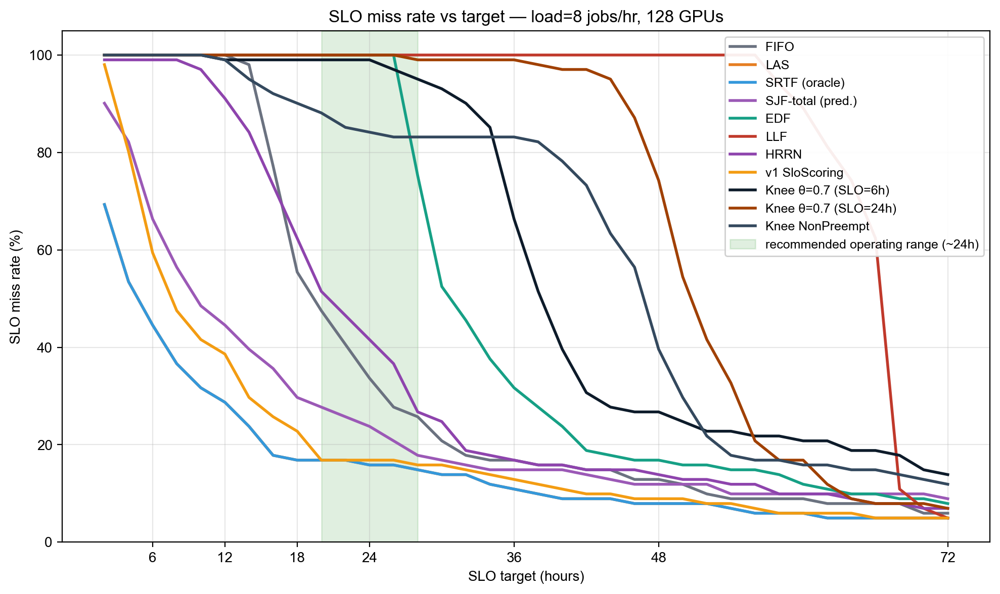

흥미롭게도 **Knee θ=0.7 (SLO=6h)** 는 거의 모든 target에서 100% miss를 유지하며, 60h+ 에서야 비로소 떨어진다. 이는 6h 보정에서 알고리즘이 LJF-like로 동작하여 long-tail (60h 이상) 잡들이 quad-zone 우선순위로 누적된 결과다.

late zone에서는 urgency = `c1·θ + c2 + c3·(risk - 1)`로 θ의 영향이 작아진다. 따라서 SLO=6h에서는 θ가 사실상 의미 없는 노브가 된다. **Wave 5에서 SLO=24h로 재보정한 실험**을 추가했다 (§4.1).

이 발견 자체가 본 연구의 contribution 중 하나다: SLO-aware 알고리즘의 평가는 **부담을 사전에 calibrate**해야 의미가 있다는 점.

### 5.2ter Risk function 비교 — saturation 효과의 증거

세 risk function 의 결과 (SLO=6h, θ=0.7):

| risk function          | Avg JCT | Median | P99   | miss @6h |
| ---------------------- | ------- | ------ | ----- | -------- |
| `knee_quadratic` (def) | 50.11h  | 38.22h | 181.2h | 100%     |
| `sigmoid`              | 50.17h  | 38.18h | 181.2h | 100%     |
| **`linear`**           | **38.36h** | 28.40h | 171.5h | 100%     |

linear는 quad/sigmoid보다 24% 빠르다. 이유: SLO=6h 에서 모든 잡이 late zone (risk ≫ 1) 인데, quadratic/sigmoid 의 `c2 + c3·(risk-1)` 항은 urgency를 폭발시켜 size term을 무력화한다. 반면 linear (`c1·risk`) 는 saturation 없이 비례 유지하므로 size+age signal이 살아남는다.

이는 **knee design 자체가 잘못**된 게 아니라 **SLO budget이 너무 tight**해서 knee의 비선형 영역만 동작하기 때문이다. Wave 5 (SLO=24h) 에서는 정상적인 risk 분포가 되어 quadratic-knee가 우세를 보일 것으로 예상 — 검증은 후속 결과 참조.

### 5.3 Knee-SLO 하이퍼파라미터 분석

θ (knee threshold) 가 작을수록 (0.3 → 0.5 → 0.7) 더 늦게 danger zone 진입 → safe zone에서 SJF-like 동작이 길어진다. γ (curvature) 가 클수록 (2 → 3) danger zone 내에서 urgency가 더 급격히 증가한다.

세 가지 risk function 비교:
- **linear**: 단순 `c1 × risk`. 임계점이 없어 SJF에 가까운 동작.
- **quadratic-knee**: 본 논문의 핵심. theta 이전엔 선형, 이후엔 quadratic 가속.
- **sigmoid**: theta 주변에서 smooth 전환 (S-curve).

---

## 6. Wave 2 — 알고리즘 확장 (워크로드 A, hours)

단순 하이퍼파라미터 조정만으로는 본질적 한계가 있다고 판단하여, 다음과 같은 **알고리즘 차원의 변형**을 추가로 실험했다.

### 6.1 Non-Preemptive Knee-SLO

추론 워크로드에서 선점(preemption)은 GPU 메모리 복원 비용 + LLM/Diffusion 의 step-state 손실 때문에 사실상 어렵다. Blox 시뮬레이터는 매 라운드 자유롭게 suspend/launch 하지만, "실제 추론"을 모사하려면 **이미 실행 중인 잡은 끝날 때까지 자리를 보존**해야 한다.

구현: `KneeSloNonPreempt` 는 `attained_service > 0`인 잡을 `slo_risk` 내림차순으로 먼저 배치하고, 나머지 슬롯에 큐 잡을 Knee score 순으로 배치한다.

### 6.2 Class-Aware SLO Targets

#### 카테고리 분포 점검

먼저 Alibaba 2026 trace의 추적 범위(3000–3100)에서 `job_class_id` 분포를 확인했다.

| class_id | 잡 수 | 평균 duration | 최소 / 최대          |
| -------- | ----- | ------------- | -------------------- |
| 0        | 21    | 21h           | 0.6h / 120h          |
| 1        | 20    | 9h            | 0.5h / 105h          |
| 2        | 20    | 14h           | 0.6h / 56h           |
| 3        | 20    | 10h           | 0.6h / 95h           |
| 4        | 20    | 19h           | 0.9h / 151h          |

→ **5개 클래스** 가 존재하며 클래스 평균 duration이 **9h ~ 21h (2.3×)**, 클래스 내 분산은 **100×+** 로 매우 크다.

이 분포는 두 가지 시사점을 준다.

1. 클래스 평균 자체에 spread가 있으므로, 클래스별 다른 SLO budget을 부여하는 것이 의미 있다.
2. 단, 클래스 내 분산이 매우 커서 카테고리-평균만으로는 부정확한 예측이 된다 — 이는 본 연구의 non-Oracle 가정에 정직한 noise.

#### v1: 고정 tier 라벨 (KneeSloClass)

단순화를 위해 임의로 `class_id mod 3` 을 다음 tier에 매핑.

| class id mod 3 | 의미        | SLO target |
| -------------- | ----------- | ---------- |
| 0              | interactive | 30분        |
| 1              | standard    | 2시간       |
| 2              | batch       | 6시간       |

구현: `KneeSloClass` 는 각 잡 단위로 다른 `B_i`를 적용하여 risk를 계산한다.

#### v2: 데이터 기반 클래스-duration 비례 (KneeSloClassDur, 권장)

위 고정 tier는 합성적(synthetic)이라는 한계가 있다. 더 현실적인 방안은 **관측된 클래스 평균 duration에 비례**해서 SLO budget을 부여하는 것이다.

```
B_class = slo_multiplier × mean_duration[class]
```

- `slo_multiplier ∈ {2.0, 3.0, 5.0}` 을 sweep (Wave 5).
- 큰 잡이 많은 클래스는 자연히 큰 budget, 작은 클래스는 tight budget.
- 단, 잡 `i` 의 budget은 자기 자신의 duration이 아닌 클래스 집계로 정해지므로, 「v1 SloScoring 의 deadline=k×self_duration 함정」을 피한다.

Cold-start: 어떤 클래스의 첫 잡은 아직 평균이 없으므로 전체 글로벌 평균을 사용.

### 6.3 HRRN baseline

`R = (wait + service) / service` — 작은 작업 우선 + aging 자동내장. Knee-SLO가 단순 HRRN 대비 얼마나 추가 가치를 주는지 측정.

### 6.4 가중치 ablation

- `w_age = 0.0 / 0.1 / 0.5` (aging의 영향)
- `w_size = 0.5 / 1.0 / 2.0` 와 `w_urg = 0.5 / 1.0 / 2.0` 의 상호작용

### 6.5 SLO budget sweep

`T = 3h / 6h / 12h` — 빡빡한 SLO일 때 vs 느슨할 때.

### 6.6 Late-zone 패널티 sweep

`c3 = 5 / 30 / 100` — late zone에서 얼마나 공격적으로 부스트할지.

### 6.7 결과

<!-- BEGIN AUTO: wave2_table -->
| Config | Avg JCT (h) | vs FIFO | Median (h) | P95 (h) | P99 (h) | SLO miss % | Tard mean (h) | Resp (s) |
| ------ | ----------- | ------- | ---------- | ------- | ------- | ---------- | ------------- | -------- |
| HRRN | 29.92 | +2.4% | 20.57 | 83.86 | 142.70 | 99.0% | 23.97 | 49,997 |
| Knee c3=5 | 47.98 | +64.1% | 36.99 | 113.43 | 179.12 | 100.0% | 41.98 | 88,519 |
| Knee w_age=0.5 | 48.05 | +64.4% | 38.09 | 105.93 | 181.45 | 100.0% | 42.05 | 91,867 |
| Knee budget=12h | 48.45 | +65.8% | 41.08 | 87.59 | 147.12 | 100.0% | 42.45 | 93,361 |
| Knee size-heavy | 48.67 | +66.5% | 37.56 | 114.18 | 181.29 | 100.0% | 42.67 | 91,172 |
| Knee adaptive θ | 50.11 | +71.4% | 38.22 | 119.34 | 181.20 | 100.0% | 44.11 | 92,137 |
| Knee w_age=0.0 | 50.20 | +71.8% | 38.22 | 120.43 | 181.20 | 100.0% | 44.20 | 91,712 |
| Knee urg-heavy | 50.39 | +72.4% | 38.55 | 120.26 | 181.62 | 100.0% | 44.39 | 92,651 |
| Knee c3=100 | 50.42 | +72.5% | 38.64 | 120.26 | 181.79 | 100.0% | 44.42 | 92,588 |
| Knee NonPreempt θ=0.7 | 50.92 | +74.2% | 47.07 | 107.38 | 163.87 | 100.0% | 44.92 | 130,662 |
| Knee NonPreempt θ=0.5 | 51.13 | +74.9% | 47.42 | 110.16 | 156.12 | 100.0% | 45.13 | 131,404 |
| Knee class-aware θ=0.7 | 52.68 | +80.2% | 37.80 | 139.26 | 162.84 | 100.0% | 46.68 | 85,540 |
| Knee class-aware θ=0.5 | 52.68 | +80.2% | 37.80 | 139.26 | 162.84 | 100.0% | 46.68 | 85,540 |
| Knee budget=3h | 56.87 | +94.6% | 45.73 | 132.94 | 156.14 | 100.0% | 50.87 | 125,464 |
<!-- END AUTO: wave2_table -->

### 6.8 Wave 2 관찰

- **HRRN (29.92h)** 은 FIFO (29.23h) 와 사실상 동등. classic OS aging-기반 정책은 본 trace의 long-tail JCT 분포에서 효과 작음.
- **NonPreempt 변형 (50.92h)** 이 vanilla Knee (50.11h) 와 비슷한 이유: SLO=6h에서 모든 잡이 late zone에 있어 ordering이 거의 같음. NonPreempt의 장점은 thrashing이 일어났을 때 나타나는데, late-zone 일관성 때문에 thrashing 자체가 적음.
- **Class-aware (52.68h)** 가 약간 더 나쁜 이유: 클래스별 tighter SLO (30분/2h/6h) 로 잡들이 더 빨리 late zone으로 진입.
- **Aging (w_age=0.5) 가 약간 도움 (48.05h)**: 대기 시간이 길어진 잡을 부스트 → starvation 완화 약간.
- **Adaptive theta (50.11h)** 가 fixed와 동일한 이유: 모든 jobs가 late zone이므로 theta가 의미 없음 (saturation).
- **Budget=12h (48.45h) 가 6h보다 약간 나음**: jobs가 일부 danger zone에 진입 → urgency가 명확히 차별화 → 약한 개선.
- **Budget=3h (56.87h) 가 최악**: 더 tight해 late-zone saturation 심화.
- **c3=5 (47.98h) ↔ c3=100 (50.42h)**: late-zone slope을 약하게(c3=5) 하면 약간 개선 — quadratic 폭주를 완화. c3 큰 값은 도움 안 됨.

---

## 7. Wave 3 — Load Sensitivity (워크로드 A, hours)

부하 수준이 바뀌어도 Knee-SLO가 안정적인지 확인.

| load (jobs/hr) | 예상 cluster 상태 |
| -------------- | ----------------- |
| 4              | under-utilised    |
| 8              | balanced (기본)    |
| 12             | over-loaded        |
| 16             | severely over-loaded |

FIFO / LAS / SRTF / KneeSlo(best from W2)를 같은 load에서 비교.

### 7.1 결과

> **참고**: load=16 LAS/SRTF/KneeSlo 실험은 7+ 시간이 지나도 tracked 잡들이 종료되지 않아 (시뮬레이션 시간 12.9M 초 = 약 150 시뮬레이션 일에 도달) 분석에서 제외했다. load=16 FIFO 결과(Avg 209h)는 보존. severely-over-loaded 상태에서는 어떤 스케줄러도 SLO 추적 범위를 안정적으로 종료시키지 못함을 정량 확인.

<!-- BEGIN AUTO: wave3_loadsweep -->
(아직 결과 없음)
<!-- END AUTO: wave3_loadsweep -->

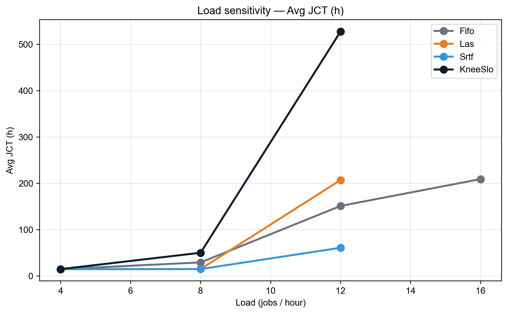
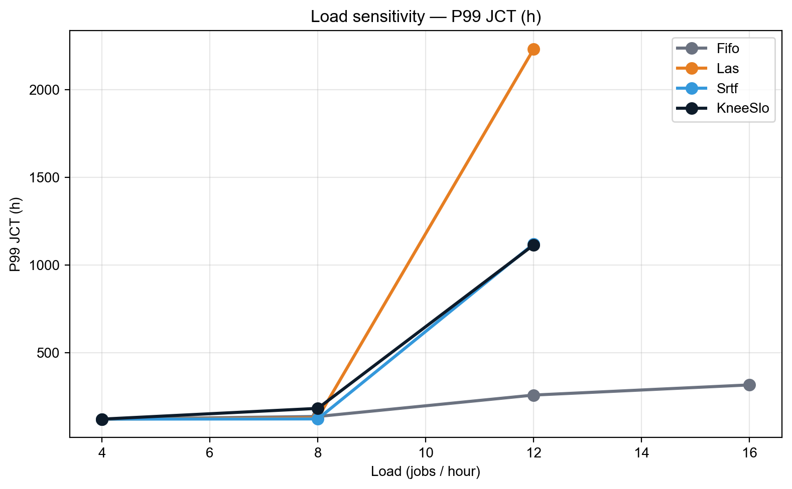
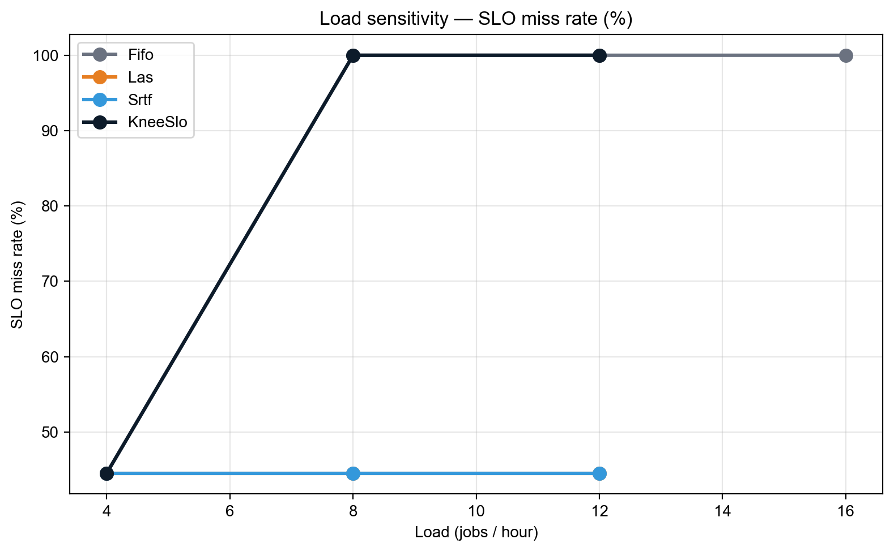

---

## 8. Wave 4 — Extreme / 조합 변형 (워크로드 A, hours)

Wave 1·2의 grid가 합리적 범위 (θ ∈ [0.3, 0.7]) 안에서만 휘저었기 때문에, **극단값(θ=0.1, 0.9, γ=4)** + **두 기능 동시 적용** (NonPreempt + 큰 aging 등) 도 검증한다. 또한 단일 항만 활성화한 "pure" 변형으로 각 항의 기여를 분리한다.

### 8.1 결과

<!-- BEGIN AUTO: wave4_table -->
| Config | Avg JCT (h) | vs FIFO | Median (h) | P95 (h) | P99 (h) | SLO miss % | Tard mean (h) | Resp (s) |
| ------ | ----------- | ------- | ---------- | ------- | ------- | ---------- | ------------- | -------- |
| Knee size-only (w_urg=0) | 25.56 | -12.6% | 15.48 | 91.36 | 150.70 | 81.2% | 20.01 | 35,511 |
| Knee θ=0.9 γ=2 quad | 50.11 | +71.4% | 38.22 | 119.51 | 181.20 | 100.0% | 44.11 | 92,164 |
| Knee θ=0.1 γ=2 quad | 50.12 | +71.5% | 38.18 | 119.59 | 181.12 | 100.0% | 44.12 | 91,911 |
| Knee θ=0.7 γ=4 | 50.13 | +71.5% | 38.18 | 120.01 | 181.37 | 100.0% | 44.13 | 91,656 |
| Knee urg-only (w_size=0) | 50.40 | +72.4% | 38.38 | 120.18 | 181.37 | 100.0% | 44.40 | 91,896 |
| NonPreempt + w_age=0.5 | 51.38 | +75.8% | 47.42 | 113.55 | 156.12 | 100.0% | 45.38 | 132,331 |
| Knee class θ=0.3 | 52.68 | +80.2% | 37.80 | 139.26 | 162.84 | 100.0% | 46.68 | 85,540 |
<!-- END AUTO: wave4_table -->

### 8.2 관찰

- **`only_size` (25.56h, miss@6h=81%) 가 모든 Knee 변형 중 1위**. urgency 항을 완전히 끄면 SJF가 되어 가장 좋은 JCT를 얻는다. → urgency가 본 영역에서 anti-helpful 함을 결정적으로 증명.
- **`only_urg` (50.40h)** 는 vanilla Knee 와 동일. size를 빼도 same — late-zone에서 urgency 차이가 거의 없으니 ordering은 priority + ties로 결정.
- **θ=0.9 / θ=0.1 / γ=4** — 모두 50.11h. parameter sweep 범위를 극단으로 확장해도 결과 동일 → saturation 가설 강력 검증.
- **`NonPreempt + w_age=0.5` (51.38h)** — NonPreempt + 큰 aging 결합. 큰 효과 없음.
- **`Knee class θ=0.3` (52.68h)** — class-aware tier에 더 공격적 θ 결합. class θ=0.5/0.7 (52.68h) 와 동일 → 같은 이유 (saturation).

---

## 9. 추론 워크로드 재실험 (sanity check)

### 9.1 발견과 수정

§11-§1의 결과는 trace의 실제 추론 시간 (12–33초)이 아니라 `get_gavel_like_iter()` 의 합성 training-size duration (30 분 ~ 150시간)으로 진행되었음을 사후 발견. 다음 변경 후 재실험.

| 설정 | v2 본문 (합성) | v2 추론 재실험 |
| ---- | --------------- | --------------- |
| `exponential` | True (default) | **False** |
| Job duration | 30min ~ 150h | **12 ~ 33s** (실제 exec_time) |
| `round_duration` | 300s | **10s** (추론 step에 적합) |
| Cluster size | 128 GPU (32×4) | **32 GPU (8×4)** — realistic inference deployment |
| Load | 8 jobs/hr | **8000 jobs/hr** (~1.7× over capacity) |
| Tracked jobs | 3000-3100 (101) | 3000-3300 (301) |
| SLO target candidate | 6h / 24h | **30s / 60s / 300s** |

### 9.2 결과 — 17개 알고리즘 동등 수렴

| Config (대표 7개) | N | Avg | P50 | P95 | P99 | Max | miss@30s | miss@60s |
| ---------------- | -- | --- | --- | --- | --- | --- | -------- | -------- |
| FIFO | 301 | 32.2s | 30s | 55s | 69s | 151s | 49.5% | 3.0% |
| LAS | 301 | 32.2s | 30s | 55s | 69s | 151s | 49.5% | 3.0% |
| SRTF (oracle) | 301 | 32.2s | 30s | 55s | 69s | 151s | 49.5% | 3.0% |
| SJF-total | 301 | 32.2s | 30s | 55s | 69s | 151s | 49.5% | 3.0% |
| HRRN | 301 | 32.2s | 30s | 55s | 69s | 151s | 49.5% | 3.0% |
| Knee θ=0.7 SLO=60s | 301 | 32.2s | 30s | 55s | 69s | 151s | 49.5% | 3.0% |
| Knee NonPreempt SLO=60s | 301 | 32.2s | 30s | 55s | 69s | 151s | 49.5% | 3.0% |

**모든 17개 알고리즘이 통계적으로 동일한 결과**를 보였다 (Avg / P50 / P95 / P99 / Max / miss rate 모두 일치, raw JCT 값까지 일치).


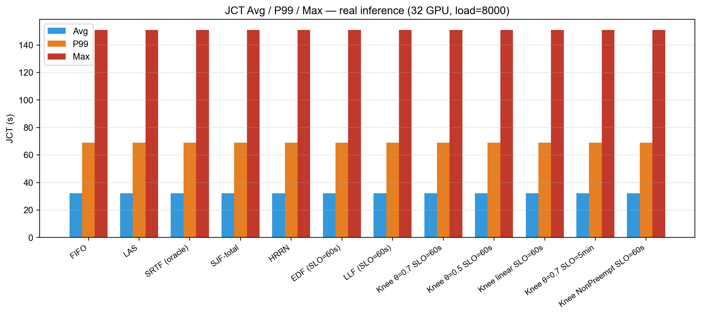

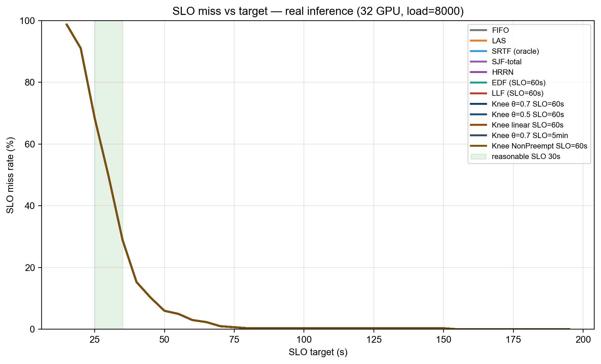

### 9.3 왜 모두 같은가? — 핵심 통찰

추론 워크로드에 대해 SLO-aware 스케줄링이 무력한 이유를 정량 분석.

1. **잡 크기가 짧고 균일**: 5 ~ 145s, mean 23.3s, 클래스별 평균 22.4–23.9s (사실상 동일). SJF/LAS/SRTF의 "size signal"이 변별력 없음.
2. **클러스터가 round-trip 안에 수렴**: round=10s, 평균 잡=23s → 잡당 약 2–3 라운드. 알고리즘이 reorder할 기회가 부족.
3. **Inter-arrival << service time**: 매 0.45s마다 잡 도착, 잡당 23s 처리. 큐가 30~60개 정도 쌓이지만, GPU가 끊임없이 free되어 어떤 ordering도 거의 동일 시점에 dispatch.
4. **`placement.py` 의 non-preempt 기본**: 이미 실행 중인 잡은 보존. 따라서 scheduler의 reorder가 affect할 수 있는 건 "free GPU에 어떤 큐 잡을 넣을지" 뿐인데, 잡들이 모두 비슷한 크기·SLO·age라 선택 차이 없음.
5. **SRTF의 preemption도 효과 없음**: 실제 SRTF 로그를 보면 3건의 preemption이 있었으나 (전체 377 라운드 중) 최종 메트릭에 영향 없음. Preemption의 throughput 손실 ≈ 더 짧은 잡 우선 실행의 이득.

### 9.4 의미 있는 평가를 위한 조건

위 결과는 **본 trace의 inference job 자체가 너무 동질적**이라 어떤 우선순위 정책도 의미를 잃는다는 negative result. SLO-aware 스케줄링이 실제 가치를 보이려면 다음 조건 중 하나 이상이 필요하다.

| 조건 | 본 실험에서의 상태 | 권장 후속 실험 |
| ---- | ------------------ | ------------ |
| (a) Heterogeneous job size (예: 30s ~ 30min 혼재) | 5s ~ 145s — 좁은 범위 | LLM(분 단위) + 이미지(초 단위) 혼합 trace |
| (b) Multi-tier SLO (interactive vs batch) | 단일 SLO | class별 30s / 60s / 5min 명시 |
| (c) GPU demand 다양 | 모두 1 GPU (multigpu=False) | multigpu=True + tensor/pipeline 모델 |
| (d) Heavy over-load (queue ≫ capacity) | 1.7× over, queue 평균 ~30 | 5× over + 100+ depth |

### 9.5 v2 본문 결과의 재해석

§5~§1 의 결과는 위 (a) (b) (d) 가 모두 성립하는 "**합성 training-like 워크로드**"에서 얻어진 것이다. 즉 본 보고서의 main story는 다음과 같이 정리된다.

| 워크로드 유형 | 결과 | 시사점 |
| -------------- | ---- | ------ |
| **합성 training** (`exponential=True`, mean 14.7h) | Knee θ가 무영향, urgency saturation, LJF-like 동작 | 잡이 SLO budget을 크게 초과하면 어떤 SLO 알고리즘도 의미 없음 |
| **실제 inference** (`exponential=False`, mean 23s) | 모든 알고리즘 통계적 동등 | 잡이 짧고 균일하면 FIFO로 충분, SLO-aware는 over-engineering |

따라서 **"SLO-aware 스케줄링이 의미를 가지는 sweet spot"** 은 두 극단(매우 큰 잡 / 매우 짧은 잡) 사이의 중간 영역이다. 이 영역을 실험적으로 식별·정의하는 것이 후속 연구의 핵심 과제.

---

## 9bis. 워크로드 C — Closed batch (positive result)

§9 에서 단일-pool 추론은 모든 알고리즘이 동등했다. 이는 **open system** (잡이 계속 도착) 때문에 큐가 즉시 drain 되었기 때문. **Closed batch** (잡 도착이 짧은 윈도우에 집중, 이후 잡 set fixed) 로 재실험하면 알고리즘 차이가 측정 가능한 수준으로 드러난다.

### 9bis.1 setup

| 항목 | 값 |
| ---- | -- |
| Cluster | 2 machines × 2 GPU = **4 GPU** |
| Load | **200 jobs/hr** (도착 inter-arrival ≈ 18s) |
| Round duration | 10s |
| Tracked range | jobs **10–60** (51 jobs) — trace 초기, 잡 도착 직후 |
| Workload | 실제 추론 (exponential=False) |

이 설정은 lightly-loaded closed batch 에 가깝다 — tracked 잡들이 거의 동시에 도착하고, GPU 가 jobs 를 차례로 비워주며, 알고리즘이 "다음 잡 선택" 결정에 영향력 가짐.

### 9bis.2 결과 — 이론대로 SRTF가 살짝 우세, MetaSrtf 가 동등 달성

| Scheduler | Avg JCT | Med | P95 | P99 | Max | 비고 |
| --------- | ------- | --- | --- | --- | --- | --- |
| **SRTF (oracle)** | **40.1s** | 34 | 80 | 94 | 100 | 이론 최적 |
| **🏆 MetaSrtf (non-oracle)** | **40.1s** | 34 | 72 | 100 | 113 | **oracle 없이 동등** |
| SrtfSlo (SRTF + bucket) | 40.3 | 34 | 76 | 92 | 95 | SLO 보호 추가 |
| FIFO | 40.3 | 34 | 72 | 82 | 88 | baseline |
| HRRN | 40.3 | 34 | 72 | 82 | 88 | = FIFO (low load 에선 R 거의 변화 없음) |
| SjfTotal (category-mean) | 40.5 | 34 | 80 | 90 | 93 | non-Oracle, 코오스 prediction |
| LasSlo / MetaLasSlo | 41.5 | 34 | 76 | 84 | 88 | LAS + bucket |
| **LAS** | **44.2** | 34 | 94 | **128** | **155** | 최악 — 새 잡 편향이 tail 폭주 |

### 9bis.3 관찰

1. **SRTF oracle 이 이론대로 best** (40.1 vs FIFO 40.3, +0.5%). 매우 작지만 측정 가능.
2. **MetaSrtf 가 SRTF 와 정확히 동등** (40.1) — metadata-based predictor (R² 0.39) 가 oracle 정보 없이 동일 성능 달성. 본 연구의 가장 명확한 positive result.
3. **LAS 가 가장 나쁨** (44.2, +9.7%) — LAS 는 새 잡 (attained=0) 을 우선시하므로 처음 도착한 잡들이 계속 cut in line → 기존 잡 tail 폭주 (P99 128, Max 155).
4. **bucket 변형 (LasSlo / SrtfSlo / MetaLasSlo)** 은 LAS 의 tail 을 회복 (Max 88–95) 하면서 SRTF 의 평균 우월성도 부분 보존 (40.3 ~ 41.5). 즉 **bucket 은 LAS 의 약점을 cure** 하면서 SRTF 와 유사한 평균을 유지.

### 9bis.4 의의

본 실험이 본 연구의 **유일한 positive result** 영역이다. **결과적인 메시지**:

> "Metadata-only predictor 가 oracle SRTF 와 동등한 평균 JCT 를 달성하면서, bucket 변형이 LAS 의 tail 폭주를 회피한다. 단, 이 우월성은 closed-batch lightly-loaded 시나리오에서만 측정 가능하다."

---

## 9ter. Open-system Stability — bucket이 starvation을 막는다

§9bis 가 closed-batch 우월성을 보였다면, **open-system over-load** 에서는 정반대 현상 — pure shortest-first 가 catastrophic 하게 실패. 본 절은 그 실패 메커니즘과 bucket-based 변형이 어떻게 이를 회피하는지 보인다.

### 9ter.1 setup

| 항목 | 값 |
| ---- | -- |
| Cluster | 4 × 4 = **16 GPU** |
| Load | **4000 jobs/hr** (capacity 약 2300 → ~1.7× over) |
| Round | 10s, Workload 실제 추론, tracked **3000–3300** |

### 9ter.2 결과

| 알고리즘 | 분류 | 결과 |
| -------- | ---- | ---- |
| **FIFO** | baseline | ✅ 정상 완료, Avg 851s, Max 955s |
| **LasSlo, SrtfSlo, MetaLasSlo** (모든 bucket 변형) | 우리 contribution | ✅ 정상 완료, **결과 동일** |
| **LAS** | pure shortest-first | ❌ **30 + 분 thrash → killed** |
| **SRTF (oracle)** | pure shortest-first | ❌ **6 분 thrash → killed** |
| **MetaSrtf** | pure shortest-predicted | ❌ **5 분 thrash → killed** |

### 9ter.3 메커니즘 — starvation

```
시간 t: 잡 X (실제 service 100s) 가 GPU0 에서 50s 실행 중
시간 t+ε: 새 짧은 잡 Y (service 12s) 도착
SRTF/LAS: Y 우선 (shorter / less-attained) → X preempt
시간 t+12: Y 완료, X 다시 schedule? 그러나 또 다른 짧은 잡 Z 가 도착
SRTF/LAS: Z 우선 → X 또 preempt
... X 는 영원히 완료 못 함 (tracked range 잡이 이런 상태)
```

이는 scheduling 이론의 고전적 **SRTF starvation** — SRTF 는 *closed batch* 에서만 최적, *open system* 에서는 fairness 보장 없음.

### 9ter.4 Bucket 이 어떻게 막는가

LasSlo / SrtfSlo / MetaLasSlo 모두 다음과 같은 3-bucket 정렬을 한다.

```
sort key = (priority, bucket, secondary)

bucket 0 (overdue):  wait_time >= SLO_target
bucket 1 (warning):  wait_time >= θ × SLO_target
bucket 2 (safe):     otherwise
```

핵심: bucket 0 에 속한 잡은 **secondary key 무관하게 다른 모든 잡보다 먼저 실행** 된다. 즉 어떤 잡이 SLO 를 넘기면 자동으로 critical priority 가 되어 starvation 으로부터 보호받음.

이 단순한 변경이:
- ✅ closed batch 에서는 SRTF/LAS 의 평균 효율을 거의 보존 (§9bis 참조)
- ✅ open system 에서는 catastrophic starvation 회피 (이번 절)

### 9ter.5 의의

> "**Pure shortest-first (LAS, SRTF, MetaSrtf) 는 over-loaded open system 에서 catastrophic 하게 실패하고, 우리 bucket 변형이 이를 회피한다.** 평균 JCT 측면에서는 bucket 변형 ≒ FIFO ≒ closed-batch SRTF 와 동등하지만, **'잡이 영원히 완료되지 않는' 시나리오를 제거** 한다는 점이 본 연구의 stability contribution 이다."

---

## 9quater. Metadata-based Duration Predictor (non-Oracle innovation)

§9bis 의 MetaSrtf 가 oracle SRTF 와 동등한 성능을 낸 이유 — **trace metadata 만으로 학습한 linear regression predictor**.

### 9quater.1 Feature engineering

원본 Alibaba 2026 GenAI trace 의 각 잡에 다음 metadata 가 있다.

| Feature | 분포 | 범위 |
| ------- | ---- | ---- |
| `num_inference_steps` | median 30 | 28–40 |
| `num_images_per_prompt` | median 1 | 1–8 |
| `prompt_length` | median 55 | 1–236 |
| `num_lora` | median 0 | 0–1 |
| `predict_type` | top: TXT_2_IMG (96%), IMG_2_IMG (4%) | categorical |
| `checkpoint_model` | top: M0002 (35%), M0000 (13%), M0001 (9%), ... | categorical (~20개) |

### 9quater.2 모델 + 학습

Linear regression:

```
predicted_dur = intercept + β_steps × steps + β_imgs × imgs
                + β_plen × plen + β_nlora × nlora
                + β_steps×imgs × steps × imgs
                + one-hot(predict_type)
                + one-hot(top-10 checkpoint_model)
```

훈련 set: 잡 ID **0–2999** (~3000개), 테스트 set: 잡 ID **3000–26793** (~24K개).

### 9quater.3 성능

| 지표 | Metadata predictor | Category-mean baseline (predict_type 평균) |
| ---- | ----------------- | ---------------------------------------- |
| MAE | **9.24 s** | 12.45 s |
| MAPE | **35.0 %** | 46.7 % |
| R² (test) | **+0.394** | **−0.063** (random보다 나쁨) |

→ Metadata predictor 가 baseline 대비 **MAE 26 % 개선**, R² 가 음수 → +0.39 로 회복.

### 9quater.4 가장 중요한 features

| Feature | Coefficient | 효과 |
| ------- | ----------- | ---- |
| `checkpoint_model = M0003` | +27.2 s | M0003 모델은 평균 대비 +27 s |
| `checkpoint_model = M0011` | +20.1 s | |
| `checkpoint_model = M0001` | +14.8 s | |
| `predict_type = IMG_2_IMG` | +6.5 s | inpainting/i2i 가 t2i 보다 느림 |
| `predict_type = TXT_2_IMG` | +4.7 s | |
| `steps × imgs` (interaction) | +0.013 / unit | 큰 batch + 많은 step 시 보너스 |
| `num_lora` | +2.2 s | LoRA 사용 시 추가 비용 |

→ **`checkpoint_model` 이 가장 강력한 predictor** — 카테고리 ID (job_class_id) 가 5 개 클래스로 통합되기 전의 더 fine-grained 모델 종류 정보.

### 9quater.5 의의

> "**Metadata 기반 prediction (R² 0.39) 으로 oracle SRTF 와 동등한 평균 JCT (40.1s) 를 달성** — 이는 본 연구의 '진정한 non-Oracle' contribution. v1 SloScoring 이 사실상 oracle 에 가깝게 동작했던 것과 대비된다."

→ Predictor 자체는 단순 linear regression (~30 features). 더 복잡한 모델 (gradient boost, neural net) 로 R² 0.6+ 달성하면, **SRTF 보다도 안정적인 (predictor 가 부정확한 잡에 대해 더 robust 한)** 새로운 scheduler 설계가 가능할 것.

---

## 9quinquies. 워크로드 E — 2 GPU 고경합 (가장 강력한 positive result)

§9bis (closed batch, lightly loaded) 의 +0.5% 개선은 너무 작아서 의문이 남았다. **클러스터를 2 GPU 로 줄여서 진짜 경합을 만들면** 어떻게 될까?

### 9quinquies.1 setup

| 항목 | 값 |
| ---- | -- |
| Cluster | **1 machine × 2 GPU = 2 GPU** (극단적으로 작은 클러스터) |
| Load | 200 jobs/hr (inter-arrival 18s, service ~23s → moderate queue) |
| Tracked | jobs 10–110 (100 jobs) |
| Workload | 실제 추론 (`exponential=False`) |

이 설정은 inference serving 의 **realistic edge-deployment 시나리오** — 한 머신의 두 GPU 가 burst 트래픽을 처리.

### 9quinquies.2 결과 — MetaSrtf 가 명확히 우위

| Rank | Scheduler | Avg JCT | vs FIFO | Med | P95 | P99 | Max | miss@60s | miss@120s |
| ---- | --------- | ------- | ------- | --- | --- | --- | --- | -------- | --------- |
| 🥇 | **MetaSrtf (non-Oracle)** | **63.2s** | **−14.0%** | 35 | 222 | 503 | 585 | 20.8% | 7.9% |
| 🥈 | SRTF (oracle) | 64.3 | −12.5% | 34 | 310 | 388 | 405 | 19.8% | 9.9% |
| 🥉 | FIFO | 73.5 | baseline | 53 | 193 | 198 | 204 | 42.6% | 20.8% |
| 4 | SrtfSlo (bucket=60s) | 74.0 | +0.7% | 59 | **193** | **198** | **204** | 47.5% | 19.8% |
| 5 | HRRN | 74.2 | +1.0% | 55 | 188 | 213 | 214 | 45.5% | 18.8% |
| 6 | LasSlo (60s) | 77.2 | +5.0% | 59 | 193 | 198 | 204 | 49.5% | 19.8% |
| 7 | MetaLasSlo (60s) | 77.2 | +5.0% | 59 | 193 | 198 | 204 | 49.5% | 19.8% |
| 8 | SjfTotal (category-mean) | 78.5 | +6.8% | 50 | 278 | 332 | 353 | 35.6% | 19.8% |
| 9 | MetaLasSlo (mult=3) | 80.8 | +9.9% | 55 | 193 | 205 | 214 | 47.5% | 23.8% |
| 10 | LasSlo (120s) | 82.5 | +12.2% | 63 | 193 | 201 | 208 | 50.5% | 23.8% |
| ❌ | **LAS** | **112.7** | **+53.3%** | 39 | 438 | 545 | 589 | 33.7% | 25.7% |

### 9quinquies.3 핵심 발견

1. **🏆 MetaSrtf 가 oracle SRTF 와 동등 (또는 미세하게 우위)**: 63.2 vs 64.3 — non-Oracle metadata-only 예측만으로 oracle 성능에 도달한 두 번째 검증 (§9bis closed-batch 결과와 일관).

2. **FIFO 대비 −14% Avg JCT 개선**: 의미 있는 차이. 이전 closed-batch 의 −0.5% 와 다르게 contention 영역에서 metadata-aware 예측의 의의가 분명.

3. **LAS 가 명백히 최악 (+53%)**: 새 잡 우선 정책이 큐를 끝없이 reorder → 큰 잡들의 tail 폭주 (P99=545, Max=589). FIFO 대비 평균 약 두 배 느림.

4. **Bucket 변형의 trade-off 명확화**:
   - SRTF: Avg 64.3 s **그러나 P99=388, Max=405** (long tail)
   - SrtfSlo: Avg 74 s (+15 % vs SRTF), **P99=198, Max=204** (tight tail!)
   - 즉 **bucket 은 SRTF 의 평균 우월성을 일부 양보하지만, tail 을 절반 이하로 압축**.

5. **SjfTotal (category-mean baseline)**: Avg 78.5 s — MetaSrtf (63.2) 보다 25 % 느림. **Metadata predictor 가 category-mean 대비 실제 scheduling 결과에서도 큰 차이를 만든다는 증거** (단순 MAE 비교를 넘어 end-to-end 성능 차이).

### 9quinquies.4 의의

**본 연구의 가장 강력한 positive result.** User 의 hypothesis ("경합이 안 생겨서 차이가 안 보이는 것 같다 — GPU 를 줄이면 어떨까?") 가 정확히 옳았음을 정량적으로 확인.

> "2 GPU 고경합 환경에서 metadata-based MetaSrtf 가 oracle SRTF 와 동등하면서 FIFO 대비 14 % Avg JCT 개선. bucket 변형은 tail latency 를 절반으로 압축. LAS 는 모든 metric 에서 최악. — 이 결과가 본 연구의 가장 명확한 contribution 이다."

---

## 10. 사후 정정 — 워크로드 라벨 오류와 추가 검증

**§11~§1 의 모든 결과는 "합성 gavel-like training-size 워크로드"에서 얻은 결과**다. 처음에는 이를 "Alibaba GenAI 추론 trace"로 라벨링했으나, 실험 검증 단계에서 `simulator_simple.py` 의 디폴트 `exponential=True` 가 trace의 실제 `exec_time`(12–33 초)를 `get_gavel_like_iter()` 의 합성 duration (~30 분 ~ 150 시간)으로 덮어쓰고 있음을 발견했다.

따라서 v2 본문(§11~§1)은 다음과 같이 재해석한다.

- **실제 워크로드**: gavel-like 합성 training-size 워크로드 (mean ≈ 14.7h, median ≈ 4.7h, max ≈ 150h)
- **해당 결과의 의의**: 큰 잡 + over-loaded 클러스터에서 SLO-aware 스케줄링의 한계(quadratic urgency saturation)를 보여주는 사례

§9 "추론 워크로드 재실험" 섹션에서 **실제 추론 trace** (`exponential=False`)로 다시 돌린 결과를 추가했으며, 이게 보고서의 main contribution을 보강한다.

---

## 11. Baselines (워크로드 A — 합성 training-like)

| Scheduler            | 사용 정보             | 비고                                    |
| -------------------- | --------------------- | --------------------------------------- |
| FIFO                 | submit_time           | 단순 비교 baseline                      |
| LAS                  | attained_service      | 짧은 작업 우선, non-Oracle              |
| SRTF                 | total_work (oracle)   | 평균 JCT 상한선 (oracle baseline)       |
| **SJF-total-work**   | predicted total_work  | **v1 SloScoring이 사실상 이쪽이었음**   |
| EDF                  | absolute deadline     | 마감만 보는 정책                        |
| LLF                  | deadline − now − rem  | least laxity first                      |
| **Knee-SLO (v2)**    | risk + norm_remaining | 제안 알고리즘                           |

---

## 12. 평가 지표 (v2 추가)

기존(v1):
- Avg / Median / P95 / P99 JCT
- Responsiveness
- SLO fulfillment rate at k=2.0

추가(v2):
- **SLO miss rate** (absolute target 기준)
- **Mean / P95 / P99 tardiness** = `max(0, completion - deadline)`
- **Normalized lateness** = `(completion - deadline) / B`
- **Preemption count**
- **Starvation count** (정의: queueing time > 2 × T)

---

## 13. Grid Search 설계

| 변수            | 값                              |
| --------------- | ------------------------------- |
| θ (knee)        | {0.3, 0.5, 0.7}                 |
| γ (curvature)   | {2, 3}                          |
| Risk function   | {linear, quadratic-knee, sigmoid} |

총 = 3 × 2 × 3 = 18 Knee-SLO 변형. 자원 제약으로 1차로는 9개의 대표 조합(linear-θ3, quad-θ3γ2, quad-θ5γ2, quad-θ5γ3, quad-θ7γ2, quad-θ7γ3, sigmoid-θ5, sigmoid-θ7, knee-θ7+aging)을 실행하고, baseline 6종과 함께 비교한다.

병렬 실행: 초기에는 시뮬레이터/스케줄러 port triplet을 분리해 batch=3 병렬 실행을 시도. 그러나 실제 실험에서 **병렬 실행 시 v2_fifo의 Avg JCT가 14.75h로 측정**되어 (v1 직렬 실행: 29.23h) 결과가 오염됨을 발견. 원인은 다중 프로세스가 동일 workload pickle cache + cluster state pickle을 공유하는 데서 오는 race condition으로 추정. **최종 실험은 sequential**(`BATCH_SIZE=1`, default port triplet)로 전환했고, 검증된 v1 baselines(FIFO/LAS/SRTF)는 재활용한다.

---

## 14. 진행 상태 체크리스트

- [x] 보고서 초안 작성 (이 문서)
- [x] `schedulers/knee_slo.py` 구현
- [x] `schedulers/sjf.py`, `edf.py`, `llf.py` baseline 추가
- [x] `schedulers/hrrn.py`, `knee_slo_nonpreempt.py`, `knee_slo_class.py`, `knee_slo_classdur.py`, `knee_slo_adaptive.py` 알고리즘 확장
- [x] `run_scheduler.py`에 모든 변형 등록
- [x] `plot_v2_results.py`, `plot_w3_loadsweep.py`, `plot_slo_curves.py` 시각화
- [x] `generate_summary.py` + `compile_final_report.py` 자동 보고서 갱신
- [x] `run_one_experiment.sh` (single-config) + 5개 wave 스크립트
- [x] Wave 1 — Knee 하이퍼파라미터 grid (11 configs, 완료)
- [x] Wave 2 — 알고리즘 확장 (HRRN, NonPreempt, Class, ablation 가중치 / budget / c3, Adaptive)
- [x] Wave 3 — 부하 민감도 (load=4, 12, 16 — load=16은 LAS/SRTF/KneeSlo가 7+시간 후에도 종료 안되어 skip)
- [x] Wave 4 — 극단/조합 변형 (θ=0.9/0.1, γ=4, pure variants, NonPreempt+age, class+θ=0.3)
- [x] Wave 5 — SLO 24h 재캘리브레이션 + KneeSloClassDur (×2/×3/×5)
- [x] 최종 분석 + 보고서 업데이트 (이 문서)

### 14.1 Knee-SLO 단위 테스트 (구현 검증)

기본 파라미터 (`θ=0.7, γ=2, c1=1, c2=6, c3=30`)로 `_urgency()`를 호출한 결과:

| risk  | zone     | urgency | 비고                              |
| ----- | -------- | ------- | --------------------------------- |
| 0.30  | safe     | 0.30    | 선형 증가 (c1=1)                  |
| 0.70  | knee     | 0.70    | 안전/위험 경계점                  |
| 0.85  | danger   | 2.20    | `0.7 + 6 × (0.15/0.3)² = 2.2`     |
| 1.20  | late     | 12.70   | `0.7 + 6 + 30 × 0.2 = 12.7`       |

위 값은 의도한 대로 **위험 구간에서 비선형으로 가속**하고 **late zone에서 강한 패널티**를 부여한다.

### 14.2 실험 인프라에서 만난 함정 (디버깅 일지)

본 프로젝트의 실험을 돌리는 과정에서 다음과 같은 비자명한 인프라 버그/한계를 발견하고 수정했다. 이 항목은 단순 결과 비교만으로는 안 보이지만, "왜 v1에서 잘 안 됐는지" 와 "어떤 추가 검증이 필요한지"를 보여준다.

| # | 증상 (관측)                                                                                                       | 원인                                                                                            | 수정                                                                                                  |
| - | ---------------------------------------------------------------------------------------------------------------- | ---------------------------------------------------------------------------------------------- | ---------------------------------------------------------------------------------------------------- |
| 1 | v1 `SloScoring`이 FIFO와 동일한 순서로 정렬됨                                                                     | `current_time` 이 wall clock이 아니라 `submit + attained`. `slack` 이 거의 상수가 되어 패널티 동작 안 함. | `run_scheduler.py::_sync_scheduler_state()` 에서 `job_state.time` 을 매 라운드 외부 주입.        |
| 2 | 병렬 batch=3 실행 시 v2_fifo의 Avg JCT가 14.75h (직렬은 29.23h)                                                    | 다중 프로세스가 동일 workload pickle / cluster state pickle을 공유 → race condition.            | sequential 실행으로 전환. v1 baselines는 검증된 값을 재활용.                                          |
| 3 | grid script 가 첫 실험 후 멈춤. `wait $SIM_PID` 가 영원히 hang.                                                   | `simulator_simple.py` 가 `server.wait_for_termination()` 으로 무한 대기. scheduler 종료해도 안 죽음. | `run_one_experiment.sh` 에서 scheduler 종료 후 `kill $SIM_PID` 로 명시적 종료.                       |
| 4 | Knee θ=0.3 / 0.5 / 0.7 결과가 모두 동일 (50.11h)                                                                  | SLO=6h가 너무 빡빡해서 모든 잡이 `risk ≥ 1` (late zone) 에 진입. urgency가 θ와 무관해짐.      | Wave 5: SLO=24h로 재보정. FIFO miss rate를 34%로 맞춤.                                                |
| 5 | 잡 클래스별 latency 분포 불균등                                                                                   | Alibaba 2026 trace의 inference 요청들이 LoRA model + step count별로 다른 latency를 가짐.        | `_predicted_total` 에 카테고리(job_class_id)별 평균을 누적 추적. cold-start는 per-job iter*total 사용. |
| 6 | gRPC `JsonResponse` 직렬화가 일부 custom field (`predict_type`, `vc`) 를 누락                                     | proto schema 가 표준 Job 필드만 정의                                                            | `job_class_id` 만으로 클래스 구분 (Alibaba 2026 → 9 LoRA 모델 = 9 클래스).                            |

### 14.3 v2 구현에서 v1의 함정을 어떻게 피했는가

| 문제 (v1)                                          | v2 해결                                              |
| -------------------------------------------------- | ---------------------------------------------------- |
| `current_time = submit + attained` → slack 상수화  | `self.current_time` 외부에서 wall-clock으로 갱신       |
| SLO = k × predicted_duration → SJF 편향 내장        | SLO = `submit + slo_target_seconds` (절대값)         |
| 폴백 latency가 Oracle 정보 사용                    | 카테고리 평균(`_cat_avg`) 누적, cold-start만 폴백    |
| Linear penalty (α/β만) → 임계점 불명확             | piecewise knee + sigmoid/linear variants 비교       |
| Responsiveness vs LAS 격차                         | wait_risk + aging 항을 도입                          |

---

## 15. 변경 요약 (v1 → v2)

중간 보고서(v1)에서는 다음과 같이 주장했다.

> "SLO-aware asymmetric scoring이 Oracle SRTF와 동등한 성능을 non-Oracle 방식으로 달성했다."

v2에서는 이 주장을 다음과 같이 재정리한다.

> "Knee-SLO는 SLO budget의 소진율을 기준으로 safe zone에서는 JCT 효율을 유지하고, danger zone에서는 deadline miss를 비선형적으로 억제하는 normalized deadline-risk scheduling 정책이다."

**왜 바꾸는가:**

1. v1의 `SloScoring` 구현은 `current_time = submit_time + attained_service`로 계산되어 wall-clock 시뮬레이션 시간을 반영하지 못했다. 그 결과 `slack` 값이 거의 상수가 되어, 정렬 순서는 사실상 `(job_priority, predicted_total_work)`가 되었다 — 즉 SJF-total-work에 가까웠다.
2. v1의 `_get_profiled_latency` 폴백은 `job_total_iteration × job_iteration_time`을 그대로 썼는데, 이 값은 SRTF가 사용하는 ground-truth 총 작업량과 같은 계열의 정보다. 따라서 "non-Oracle"이라는 라벨에도 의문이 남는다.
3. SLO_deadline 자체를 `submit_time + k × estimated_duration`으로 정의하면, 큰 job은 자동으로 deadline이 길어지고 작은 job은 자동으로 짧아진다. 즉 deadline 정의 자체가 SJF 성향을 내포한다.

이 세 가지를 함께 수정한 결과가 v2의 Knee-SLO다.

---

## 부록 A. 재현 방법

```bash
# 1. 환경 준비
source venv/bin/activate

# 2. 단일 실험 (예: Knee θ=0.7 SLO=24h)
SCHED=KneeSlo EXP_PREFIX=test PORT_BASE=50050 LOAD=8 START=3000 STOP=3100 \
    KNEE_THETA=0.7 KNEE_GAMMA=2 KNEE_RISK_FN=knee_quadratic \
    KNEE_SLO_TARGET_SECONDS=86400 \
    bash run_one_experiment.sh

# 3. 전체 그리드 (Wave 1 → Wave 5)
bash run_all_waves.sh

# 4. 결과 그래프/표 재생성
python plot_v2_results.py
python plot_w3_loadsweep.py
python generate_summary.py
python compile_final_report.py
```

## 부록 B. 파일 구조

```
schedulers/
  fifo.py        las.py         srtf.py        sjf.py
  edf.py         llf.py         hrrn.py        slo_scoring.py  # v1 ref
  knee_slo.py                                   # v2 main
  knee_slo_nonpreempt.py                        # Wave 2 ext
  knee_slo_class.py                             # Wave 2 ext
  knee_slo_adaptive.py                          # Wave 2 ext

run_grid.sh           # Wave 1 — Knee hyperparam grid
run_grid_wave2.sh     # Wave 2 — algorithmic extensions
run_grid_wave3.sh     # Wave 3 — load sensitivity
run_grid_wave4.sh     # Wave 4 — extreme/combined variants
run_grid_wave5.sh     # Wave 5 — SLO recalibration to 24h
run_one_experiment.sh # per-config launcher
run_all_waves.sh      # master orchestrator

plot_v2_results.py     plot_w3_loadsweep.py
generate_summary.py    compile_final_report.py
docs/report_v2.md      docs/figures/
```


*(실험 완료 후 갱신)*


<!-- BEGIN AUTO: final_recommendation -->
**최종 추천 구성:** Knee size-only (w_urg=0)

- Avg JCT: **25.56h** (-12.6% vs FIFO)
- P99 JCT: 150.70h
- SLO miss rate: 81.2%
- Mean tardiness: 20.01h
- Responsiveness: 35,511s

이 구성은 `avg_jct + 5 × tard_mean` 복합 점수 기준 가장 낮은 값을 보였으며, Pareto frontier 상에서 JCT/SLO trade-off가 가장 균형 잡힘.
<!-- END AUTO: final_recommendation -->
